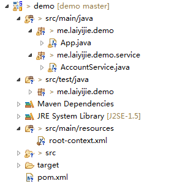
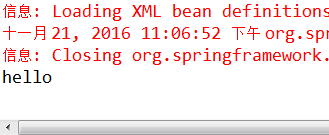

转载请注明来源 [赖赖的博客](http://laiyijie.me)
## 导语
> 实践是检验真理的唯一标准。

想了很久不知道怎么开头，但是为了写博客这个动机可以一直保持下去，还是下定决心从头搭建一个工程开始。
<!-- more -->
## 一、搭建应用前准备（可先看后面的，再回来搞环境）
### 需要具备的知识
重复一下上一节有讲到的基础：

	1. 了解java语言（推荐 java编程思想）
	2. 了解MAVEN （推荐 MAVEN实战）

### 代码工程（版本Log将会注明每一个版本对应的课程）

https://github.com/laiyijie/SpringLearning

### 环境（IDE）

Spring公司推出的集成IDE工具[Spring Tool Suite](http://spring.io/tools/sts/all)  版本为3.8.2 

### 导入Maven工程（MAVEN基本使用，不赘述）

	1. git clone 主干版本到本地
	2. 打开STS
	3. file>import>Exist Maven Project
	4. 选择clone下来的文件夹
	5. 稍等片刻

## 二、第一个Spring应用

工程文件结构：

标准的Maven工程，对Maven不熟悉的可以先简单了解一下Maven

### i. 运行工程

查看App.java 发现有个Main函数，不妨就运行一下他！

#### 执行结果：

漂亮！ 不是 hello world，是hello！

好了，就从Main函数切入，查看Spring是如何运行的！

### ii. App.java

	package me.laiyijie.demo;
	
	import org.springframework.context.support.ClassPathXmlApplicationContext;
	import me.laiyijie.demo.service.AccountService;
	
	/**
	 * Hello
	 *
	 */
	public class App {
		public static void main(String[] args) {
			ClassPathXmlApplicationContext context = new ClassPathXmlApplicationContext("root-context.xml");
	
			AccountService accountService = context.getBean(AccountService.class);
	
			System.out.println(accountService.sayHello());
	
			context.close();
		}
	}

> 只有四行代码，我相信你有耐心看完。
>

#### 第一行代码
> **ClassPathXmlApplicationContext context = new ClassPathXmlApplicationContext("root-context.xml");**

我们创建了一个对象，这个类的名称叫做`ClassPathXmlApplicationContext` 它载入了一个名字为`root-context.xml`的文件

而这个文件正是Spring的配置文件，他配置了一个`ClassPathXmlApplicationContext`对象，高级一点儿的说法就是，Spring的上下文环境（术语太厉害往往听不懂）

那这个环境到底有什么用呢？请看第二行代码

#### 第二行代码
> **AccountService accountService = context.getBean(AccountService.class);**

注意！我们使用了`ClassPathXmlApplicationContext`中的一个`getBean`方法，并获取了一个**AccountService**对象！

`ClassPathXmlApplicationContext` 的功能一目了然！！就是一个`对象工厂`嘛，里面保存了一些对象！

是的，你没有看错，Spring的上下文工具就是一个工厂，一个保存对象的工厂，你需要的时候就用`getBean`方法从工程里面取就好了！

而这个对象我们就叫他 `JavaBean`

第二行代码读完，我们就明白了两个概念：

1. Spring Context是一个对象工厂（可以这么简单的认为）
2. Java Bean 就是工厂里面的一个对象！

#### 第三第四行代码

- 调用了AccountService里面的一个方法
- 关闭了对象工厂

### iii. 在SpringContext配置文件中配置一个JavaBean（对象）

AccountService是咱们自己写的一个类，很简单，就只有一个方法，sayHello，并且返回一个"hello"字符串

#### AccountService.java

	package me.laiyijie.demo.service;
	
	public class AccountService {
	
		public String sayHello() {
	
			return "hello";
		}
	}

在Main函数中没有new过这个对象，也就是说这个对象的创建并不是由我们自己创建，而是通过`ClassPathXmlApplicationContext`进行创建，而`ClassPathXmlApplicationContext`中包含什么对象，是通过 `root-context.xml` 来确认的

#### root-context.xml
	<?xml version="1.0" encoding="UTF-8"?>
	<beans xmlns="http://www.springframework.org/schema/beans"
		xmlns:xsi="http://www.w3.org/2001/XMLSchema-instance" xmlns:context="http://www.springframework.org/schema/context"
		xsi:schemaLocation="http://www.springframework.org/schema/beans http://www.springframework.org/schema/beans/spring-beans.xsd
			http://www.springframework.org/schema/context http://www.springframework.org/schema/context/spring-context-4.3.xsd">
	
		<bean class="me.laiyijie.demo.service.AccountService"></bean>
	
	</beans>

忽略头部看重点

	<bean class="me.laiyijie.demo.service.AccountService"></bean>

语意很明显： 我要定义一个bean，这个bean是 me.laiyijie.demo.service.AccountService 这个类创建的实例；
> 人话： 创建一个AccountService的对象

### iv. Maven的环境依赖是pom.xml代码如下

	<project xmlns="http://maven.apache.org/POM/4.0.0" xmlns:xsi="http://www.w3.org/2001/XMLSchema-instance"
		xsi:schemaLocation="http://maven.apache.org/POM/4.0.0 http://maven.apache.org/xsd/maven-4.0.0.xsd">
		<modelVersion>4.0.0</modelVersion>
	
		<groupId>me.laiyijie</groupId>
		<artifactId>demo</artifactId>
		<version>0.0.1-SNAPSHOT</version>
		<packaging>jar</packaging>
	
		<dependencies>
		
			<!-- https://mvnrepository.com/artifact/org.springframework/spring-context -->
			<dependency>
				<groupId>org.springframework</groupId>
				<artifactId>spring-context</artifactId>
				<version>4.3.2.RELEASE</version>
			</dependency>
	
		</dependencies>
	</project>

此处只引入了一个依赖

1. spring-context （Spring 上下文）

### v. 总结

项目当前总共四个文件，除去maven工程的pom.xml 剩余三个文件；

调用过程如下

1. `App.java`中有Main函数，程序从这里开始执行
2. Main函数第一行代码创建了一个对象工厂（SpringContext）配置文件是`root-context.xml`
3. `root-context.xml`中定义了一个对象（也叫JavaBean）对象来源于AccountService类
4. AccountService类在`AccountService.java`中定义，只有一个sayHello函数
5. Main函数中调用`ClassPathXmlApplicationContext`对象的`getBean`方法获取了`root-context.xml`中定义个AccountService对象
6. 调用AccountService中的sayHello方法

而这个过程，也就是很多人说的控制反转（IoC），也就是Spring的核心！
