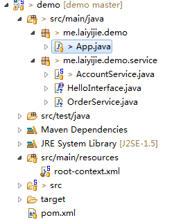

# 02 Spring 控制反转 （IoC） 有什么用

## 导语
> 你不知道的，并不代表不存在。

说起IoC有什么用，一定要结合**面向接口编程**。

## 实例

### 项目工程目录结构和代码获取地址

#### 获取地址（版本Log将会注明每一个版本对应的课程）
https://github.com/laiyijie/SpringLearning

#### 目录结构

### 运行工程

运行具有Main函数的 App.java
得到如下输出

> hello account

### 详细解读

依旧，我们从main函数入手！

#### App.java

    package me.laiyijie.demo;
    
    import org.springframework.context.support.ClassPathXmlApplicationContext;
    import me.laiyijie.demo.service.HelloInterface;
    
    public class App {
    	public static void main(String[] args) {
    		ClassPathXmlApplicationContext context = new ClassPathXmlApplicationContext("root-context.xml");
    
    		HelloInterface accountService = context.getBean(HelloInterface.class);
    
    		System.out.println(accountService.sayHello());
    
    		context.close();
    	}
    }
    
主函数中依旧只有四行代码！而与上一课相比，发生的变化只有这一处：

	HelloInterface accountService = context.getBean(HelloInterface.class);

原来是这样的：

	AccountService accountService = context.getBean(AccountService.class);

在此处，我将AccountService替换成HelloInterface！

那我们不妨看一下HelloInterface定义了什么？
  
#### HelloInterface.java
    package me.laiyijie.demo.service;
    
    public interface HelloInterface {
    	public String sayHello();
    }
    
HelloInterface 这个接口只定义了一个方法，`sayHello`，而在AccountService中，实现了HelloInterface这个接口！

#### AccountService.java
	
	package me.laiyijie.demo.service;
	
	public class AccountService implements HelloInterface {
	
		public String sayHello() {
	
			return "hello account";
		}
	}

至此我们可能就明白了一点，通过`ApplicationContext`的`getbean`方法可以获取到接口对应的实现类！而这个实现类是在root-context.xml中定义的！

#### root-context.xml

	<?xml version="1.0" encoding="UTF-8"?>
	<beans xmlns="http://www.springframework.org/schema/beans"
		xmlns:xsi="http://www.w3.org/2001/XMLSchema-instance" xmlns:context="http://www.springframework.org/schema/context"
		xsi:schemaLocation="http://www.springframework.org/schema/beans http://www.springframework.org/schema/beans/spring-beans.xsd
				http://www.springframework.org/schema/context http://www.springframework.org/schema/context/spring-context-4.3.xsd">
	
		<bean class="me.laiyijie.demo.service.AccountService"></bean>
	
	</beans>
	
如你所见，这里定义了一个AccoutService的对象（JavaBean对象）；

#### 小结

1. Main函数首先通过`root-context.xml`配置了一个`ApplicationContext`上下文环境（也就是Bean工厂），而`root-context.xml中`定义了实现了`HelloInterface`的`AccountService`类的实例！
2. Main函数中调用了`ApplicationContext`的`getBean`方法获取`HelloInterface`接口实现类的实例，也就是`root-context.xml`中定义的`AccountService`的实例！
3. 调用了`HelloInteface`接口的函数 `sayHello`（实际调用的是 `AccountService`的`sayHello`)

也就是说，在这个过程中，Main函数中到底调用的哪个具体的对象的`sayHello`方法是由`root-context.xml`来决定的！

而换句话说！

- 我们再写一个实现了HelloInterface的类：

#### OrderService.java
	
	package me.laiyijie.demo.service;
	
	public class OrderService implements HelloInterface {
	
		public String sayHello() {
			
			return "hello order!";
		}
	
	}

- 并在root-context.xml中修改如下：

#### root-context.xml （修改后）

    <?xml version="1.0" encoding="UTF-8"?>
    <beans xmlns="http://www.springframework.org/schema/beans"
    	xmlns:xsi="http://www.w3.org/2001/XMLSchema-instance" xmlns:context="http://www.springframework.org/schema/context"
    	xsi:schemaLocation="http://www.springframework.org/schema/beans http://www.springframework.org/schema/beans/spring-beans.xsd
    			http://www.springframework.org/schema/context http://www.springframework.org/schema/context/spring-context-4.3.xsd">
    
    	<bean class="me.laiyijie.demo.service.OrderService"></bean>
    
    </beans>

此时再运行App.java会发现控制台打出：

> hello order!

成功替换sayHello的实现类，而**没有修改原有代码**，只修改了配置文件！

### 总结：

IoC有什么用？

如果你对设计模式有所了解，可以知道，上面的例子其实是策略模式，而配合IoC，这种模式可以在不修改调用者代码的基础上，灵活替换不同的算法和策略！

简而言之：

> IoC将调用者和被调用者解耦，并通过配置文件进行关联！

而这个做法的好处是：

> 在需要做变更的时候，可以不用修改旧代码，而是通过添加新的代码和修改配置文件来解决扩展问题，减少维护成本和改旧代码带来的额外成本。

也就是满足了
> 开闭原则

### 附：

#### pom.xml

	<project xmlns="http://maven.apache.org/POM/4.0.0" xmlns:xsi="http://www.w3.org/2001/XMLSchema-instance"
		xsi:schemaLocation="http://maven.apache.org/POM/4.0.0 http://maven.apache.org/xsd/maven-4.0.0.xsd">
		<modelVersion>4.0.0</modelVersion>
	
		<groupId>me.laiyijie</groupId>
		<artifactId>demo</artifactId>
		<version>0.0.1-SNAPSHOT</version>
		<packaging>jar</packaging>
	
		<dependencies>
		
			<!-- https://mvnrepository.com/artifact/org.springframework/spring-context -->
			<dependency>
				<groupId>org.springframework</groupId>
				<artifactId>spring-context</artifactId>
				<version>4.3.2.RELEASE</version>
			</dependency>
	
		</dependencies>
	</project>
