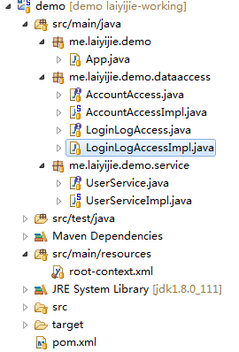

## 导语
> 你知道的越多，越容易接受新的知识。

Spring IoC是有应用场景的，其特定决定了应用的结构；也就是说，一旦你用了Spring，也就受到了框架的限制，只能使用一些特定的设计模式。

<!-- more -->

## 实例

### 项目工程目录结构和代码获取地址

#### 获取地址（版本Log将会注明每一个版本对应的课程）
https://github.com/laiyijie/SpringLearning

#### 目录结构

乍一看，工程似乎打出上一次不少，多了好多；然而程序员做事，向来不会毫无章法，自有其中的规律，而其中的规律了解了，文件再多，也只是重复的工作量；

这个所谓的章法，就是今天要说的重点之一，应用的分层；

### Spring应用结构

现在工程有三个包，包之间的关系如下：

- 应用层：`me.laiyijie.demo` , 只调用**服务层**
- 服务层：`me.laiyijie.demo.service`，只调用**数据层**
- 数据层：`me.laiyijie.demo.dataaccess`，最底层，直接操作持久化数据（文件、数据库等）

具体含义如下：

#### me.laiyijie.demo
最上层的应用层

- **向上**：对应的是整个应用的出入口，现在的表现就是，可以打印到控制台！
- **向下**： **只调用了`me.laiyijie.demo.service`层**，也就是说Service层对这一层提供了服务！
- **职责**：负责处理入口数据和出口数据（如输出输入的格式化等）

#### me.laiyijie.demo.service
业务逻辑层，所有的业务逻辑应该在这一层实现；

- **向上**： 向应用层提供服务，也就是提供接口给`me.laiyijie.demo`这一层的函数调用
- **向下**： **只调用了`me.laiyijie.demo.dataaccess`层**
- **职责**：通过调用dataaccess层实现业务逻辑，并且向应用层提供服务。

#### me.laiyijie.demo.dataaccess
数据连接层，屏蔽底层于文件、数据库等持久化操作；

- **向上**：向service层提供服务，使得服务层无需直接操作文件等持久化数据
- **向下**： SQL，文件读写的
- **职责**：通过调用JDBC等直接操作数据库和文件等持久化数据

### 小结

分层满足两个原则：

1. 各层职责明确
2. 仅调用自己的下一层，不会越层调用

### 运行工程
运行具有Main函数的 App.java
得到如下输出
> false

### 详细解读

程序入口为App.java从这里入口读代码

#### App.java

	package me.laiyijie.demo;
	
	import org.springframework.context.support.ClassPathXmlApplicationContext;
	
	import me.laiyijie.demo.service.UserService;

	public class App {
		public static void main(String[] args) {
			ClassPathXmlApplicationContext context = new ClassPathXmlApplicationContext("root-context.xml");
			
			UserService userService = context.getBean(UserService.class);
			
			System.out.println(userService.login("lailai", "laiyijie","127.0.0.1"));
			
			context.close();
		}
	}

Main函数中依旧只有四行代码，这里引用到了`UserService`，并且调用了`UserService`的`login`方法。

我们来看下`UserService`

#### UserService.java
	
	package me.laiyijie.demo.service;
	
	public interface UserService{
		
		boolean login(String username,String password,String ip);
		
	}

OK，非常简单，只是一个接口，定义了有这么一个方法，具体实现是在同一个包下面的另一个文件，UserServiceImpl.java中

#### UserServiceImpl.java
	
	package me.laiyijie.demo.service;
	
	import me.laiyijie.demo.dataaccess.AccountAccess;
	import me.laiyijie.demo.dataaccess.LoginLogAccess;
	
	public class UserServiceImpl implements UserService {
	
		private AccountAccess accountAccess;
		
		private LoginLogAccess loginLogAccess;
		
		public boolean login(String username, String password,String ip) {
			
			if (!accountAccess.isAccountExist(username)) {
				return false;
			}
			
			if (accountAccess.isPasswordRight(username, password)) {
				accountAccess.updateLastLoginTime(username);
				loginLogAccess.addLoginLog(username, ip);
				return true;
			}
			return false;
		}
	
		public AccountAccess getAccountAccess() {
			return accountAccess;
		}
	
		public void setAccountAccess(AccountAccess accountAccess) {
			this.accountAccess = accountAccess;
		}
	
		public LoginLogAccess getLoginLogAccess() {
			return loginLogAccess;
		}
	
		public void setLoginLogAccess(LoginLogAccess loginLogAccess) {
			this.loginLogAccess = loginLogAccess;
		}
	}

乍一看这个代码，好长，函数好多。其实并不复杂，
如果你对Java有一些了解的话应该知道，后面的四个函数是getter和setter函数，是向外提供了操作私有变量的方法；
而最前面一个函数正是实现了UserService这个接口。

在这个类中，我们可以看到，其通过私有变量的方式引用了`dataaccess`层的两个对象！

	private AccountAccess accountAccess;
	
	private LoginLogAccess loginLogAccess;

那么，在没有使用Spring的情况下，我们的main函数应该这样调用login方法：

	public static void main(String[] args) {

		AccountAccess accountAccess = new AccountAccessImpl();
		LoginLogAccess loginLogAccess = new LoginLogAccessImpl();
		
		UserServiceImpl userServiceImpl = new UserServiceImpl();
		userServiceImpl.setAccountAccess(accountAccess);
		userServiceImpl.setLoginLogAccess(loginLogAccess);
		
		userServiceImpl.login("lailai", "laiyijie", "127.0.0.1");
	}

然而在App.java中，我们直接

	UserService userService = context.getBean(UserService.class);
			
	System.out.println(userService.login("lailai", "laiyijie","127.0.0.1"));

也就是说，对象创建，以及`对象之间的依赖关联`通过root-context.xml来完成！

#### root-context.xml
	
	<?xml version="1.0" encoding="UTF-8"?>
	<beans xmlns="http://www.springframework.org/schema/beans"
		xmlns:xsi="http://www.w3.org/2001/XMLSchema-instance" xmlns:context="http://www.springframework.org/schema/context"
		xsi:schemaLocation="http://www.springframework.org/schema/beans http://www.springframework.org/schema/beans/spring-beans.xsd
				http://www.springframework.org/schema/context http://www.springframework.org/schema/context/spring-context-4.3.xsd">
	
		<bean id="accountAccessImpl" class="me.laiyijie.demo.dataaccess.AccountAccessImpl" ></bean>
		<bean id="loginLogAccessImpl" class="me.laiyijie.demo.dataaccess.LoginLogAccessImpl"></bean>
		
		<bean class="me.laiyijie.demo.service.UserServiceImpl">
			<property ref="accountAccessImpl" name="accountAccess"></property>
			<property ref="loginLogAccessImpl" name="loginLogAccess"></property>
		</bean>
	
	</beans>

经过前两节课的基础，你应该可以轻易看懂这些配置，无非就是完成了对象的创建和属性的设置操作；也就是与这段代码的功能一样：

		AccountAccess accountAccess = new AccountAccessImpl();
		LoginLogAccess loginLogAccess = new LoginLogAccessImpl();
		
		UserServiceImpl userServiceImpl = new UserServiceImpl();
		userServiceImpl.setAccountAccess(accountAccess);
		userServiceImpl.setLoginLogAccess(loginLogAccess);

而这种配置方法，也就被称为**属性注入**

### 小结

- 属性注入就是通过Spring的配置文件可以完成对对象`属性`的配置，从而使得不从层次的对象之间产生`依赖关系`，换句话讲，就是
	> 属性注入提供了层与层之间的调用方式
- 然而恰恰就是这种依赖注入的方式，使得层次的划分是水平划分，是一层一层的向上提供服务！
- Spring提供的注入方式还有一种就是构造注入，也就是在构造方法的时候注入属性，如果理解了属性注入想必不难理解构造注入。此处不展开，因为属性注入可以满足绝大部分的应用场景

