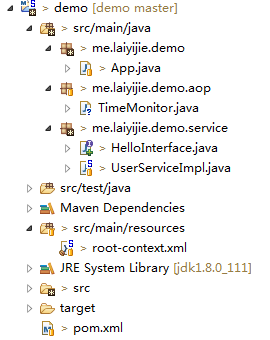

转载请注明来源 [赖赖的博客](http://laiyijie.me)

## 导语
> 没有什么是不可以改变的，换个角度看世界，截然不同！

IoC相关的基本内容告一段落，本次介绍Spring的第二个特性，AOP，面向切面编程，术语听起来比较不容易理解，没关系，一切尽在实例中，让我们看一个简单的实例，就能明白。

<!-- more -->

## 实例

### 项目工程目录结构和代码获取地址

#### 获取地址（版本Log将会注明每一个版本对应的课程）
https://github.com/laiyijie/SpringLearning

#### 目录结构

#### 运行工程
运行具有Main函数的 App.java
得到如下输出
> method start time:1480223298250  
> userHello  
> method end time:1480223299250  

### 项目详解

从App.java入手

#### App.java      
    package me.laiyijie.demo;
    
    import org.springframework.context.support.ClassPathXmlApplicationContext;
    
    import me.laiyijie.demo.service.HelloInterface;
    
    public class App {
    	public static void main(String[] args) {
    		ClassPathXmlApplicationContext context = new ClassPathXmlApplicationContext("root-context.xml");
    
    		HelloInterface userService = context.getBean(HelloInterface.class);
    
    		userService.sayHello();
    
    		context.close();
    	}
    }

调用的是`HelloInterface`的`sayHello`方法

#### HelloInterface.java  
	package me.laiyijie.demo.service;
	
	public interface HelloInterface{
		
		void sayHello();
		
	}  

其实现类为UserServiceImpl.java

#### UserServiceImpl.java  
	package me.laiyijie.demo.service;
	
	import org.springframework.stereotype.Service;
	
	@Service
	public class UserServiceImpl implements HelloInterface {
	
		public void sayHello() {
			try {
				Thread.sleep(1000);
			} catch (InterruptedException e) {
				// TODO Auto-generated catch block
				e.printStackTrace();
			}
			System.out.println("userHello");
		}
		
	}  

诶？情况跟我们看到的代码有出入？  
sayHello 应该只输出 userHello，前后两行输出从何出现？  
在Main函数中找不到一点儿线索！  

这就是AOP的一个强大特性：  
> 无侵入性，不改变原有的代码，却能增加功能！  

那么究竟是如何增加功能的呢？  

让我们看看TimeMonitor.java

#### TimeMonitor.java  
    
	package me.laiyijie.demo.aop;
	
	import org.aspectj.lang.ProceedingJoinPoint;
	import org.aspectj.lang.annotation.Around;
	import org.aspectj.lang.annotation.Aspect;
	import org.springframework.stereotype.Service;
	
	@Service
	@Aspect
	public class TimeMonitor {
	
		@Around("execution(* me.laiyijie.demo.service.UserServiceImpl.sayHello(..))")
		public void monitorAround(ProceedingJoinPoint pjp) throws Throwable {
	
			System.out.println("method start time:" + System.currentTimeMillis());
	
			Object re = pjp.proceed();
	
			System.out.println("method end time:" + System.currentTimeMillis());
	
		}
	}

终于看到了 `method start time:1480223298250` 和 `method end time:1480223299250 `这两行输出是从哪儿出现的了！  

让我们来仔细解读一下这个类

- 类有两个注释，分别是@Service和@Aspect，第一个注解是使得TimeMonitor受Spring托管并实例化。@Aspect就是使得这个类具有AOP功能（你可以这样理解）两个注解缺一不可  

类里面只有一个方法，名字叫做monitorAroud，其实就是为了检测函数执行时间的！

那么关键点来了，两个输出语句是怎么插入到sayHello方法的前后的呢！

看这个注解：

>  @Around("execution(* me.laiyijie.demo.service.UserServiceImpl.sayHello(..))")

- @Around表示包围一个函数，也就是可以在函数执行前做一些事情，也可以在函数执行后做一些事情
- `execution(* me.laiyijie.demo.service.UserServiceImpl.sayHello(..))` 这个比较好理解，就是使用表达式的方式指定了要对哪个函数进行包围！（除了execution以外还有很多，可以搜索AspectJ语法来学习）

也就是说，这个注解完整的说明了，应该在函数的什么位置插入变化，也就是所谓的**切点**  

之后是函数的定义：

> public Object monitorAround(ProceedingJoinPoint pjp)   

这里引入了`ProceedingJoinPoint`，在使用了@Around之后可以带入这个参数，代表的其实就是sayHello这个函数，不过做了一些封装  
而 `Object re = pjp.proceed();` 就是相当于执行了 `sayHello`方法！

剩下的代码就不用过多解释了，就是在执行这个函数的前后分别进行了系统时间的获取。

我们把这个函数体，也就是定义了要做那些事情的代码，称作**增强**  

而包含**切点**和**增强**结合起来就称作**切面**  
面向切面由此而来！

#### Spring AOP 开启需要的配置

需要配置两项

1. pom.xml增加依赖（因为要用到AOP还需要不同的JAR包）  
2. root-context.xml中增加切面相关配置

##### root-context.xml  
	<?xml version="1.0" encoding="UTF-8"?>
	<beans xmlns="http://www.springframework.org/schema/beans"
		xmlns:xsi="http://www.w3.org/2001/XMLSchema-instance"
		xmlns:context="http://www.springframework.org/schema/context"
		xmlns:aop="http://www.springframework.org/schema/aop"
		xsi:schemaLocation="http://www.springframework.org/schema/beans http://www.springframework.org/schema/beans/spring-beans.xsd
			http://www.springframework.org/schema/context http://www.springframework.org/schema/context/spring-context-4.3.xsd
			http://www.springframework.org/schema/aop http://www.springframework.org/schema/aop/spring-aop-4.3.xsd">
			
		<aop:aspectj-autoproxy></aop:aspectj-autoproxy>
		<context:component-scan base-package="me.laiyijie.demo"></context:component-scan>
	
	</beans>
	
root-context.xml 增加了两行

1. `xmlns:aop="http://www.springframework.org/schema/aop"` 代表加入命名空间
2. `<aop:aspectj-autoproxy></aop:aspectj-autoproxy>` 使用1中引入的aop命名空间开起自动代理（自动代理具体含义后续慢慢解释，简单的理解就是AOP的实现是依靠自动代理实现的）

##### pom.xml

	
	<project xmlns="http://maven.apache.org/POM/4.0.0" xmlns:xsi="http://www.w3.org/2001/XMLSchema-instance"
		xsi:schemaLocation="http://maven.apache.org/POM/4.0.0 http://maven.apache.org/xsd/maven-4.0.0.xsd">
		<modelVersion>4.0.0</modelVersion>
	
		<groupId>me.laiyijie</groupId>
		<artifactId>demo</artifactId>
		<version>0.0.1-SNAPSHOT</version>
		<packaging>jar</packaging>
	
		<dependencies>
	
			<!-- https://mvnrepository.com/artifact/org.springframework/spring-context -->
			<dependency>
				<groupId>org.springframework</groupId>
				<artifactId>spring-context</artifactId>
				<version>4.3.2.RELEASE</version>
			</dependency>
			
			<!-- https://mvnrepository.com/artifact/org.aspectj/aspectjweaver -->
			<dependency>
				<groupId>org.aspectj</groupId>
				<artifactId>aspectjweaver</artifactId>
				<version>1.8.9</version>
			</dependency>
	
		</dependencies>
	</project>

增加了一个依赖

- AspectJ 一个强大的AOP框架，也就是@Aspect和@Around以及ProceedingJoinPoint这些注解和方法的提供者

### 小结

1. 增强：定义了应该怎么把额外的动作加入到指定函数中
2. 切点：定义了你应该把增强插入到哪个函数的什么位置
3. 切面：**切点**和**增强**组合起来的称呼

尽情享受AOP吧！给你一个不同寻常的体验
