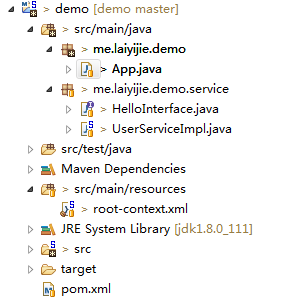

转载请注明来源 [赖赖的博客](http://laiyijie.me)

## 导语
> 一个简单的抽象，可以解决百分之八十的问题。

在写Spring 应用的时候，会遇到一些异步执行和任务调度的问题，例如：Spring MVC中需要向微信发送请求，告诉微信进行公众号推送。这个时候需要用到异步执行，而周报表、月报表、日最高点击等，需要用到任务调度。  
Spring高度凝聚了及其简单的调度和异步执行方式，迅速解决百分之八十的问题。 

<!-- more -->

## 实例

### 项目工程目录结构和代码获取地址

#### 获取地址（版本Log将会注明每一个版本对应的课程）
https://github.com/laiyijie/SpringLearning

#### 目录结构

#### 运行工程
运行具有Main函数的 App.java
得到如下输出
> the 2 time to say userHello  
> the 0 time to say userHello  
> the 3 time to say userHello  
> the 1 time to say userHello  
> the 4 time to say userHello  
> the 6 time to say userHello  
> the 5 time to say userHello  
> the 8 time to say userHello  
> the 9 time to say userHello  
> the 7 time to say userHello  
> time:1480341514063 userHello  
> time:1480341515064 userHello  
> time:1480341516065 userHello  
> time:1480341517066 userHello  
> time:1480341518067 userHello  
> time:1480341519068 userHello  
> time:1480341520069 userHello  
> time:1480341521070 userHello  
> time:1480341522071 userHello  

### 项目详解

从App.java入手

#### App.java     
    package me.laiyijie.demo;
    
    import org.springframework.context.support.ClassPathXmlApplicationContext;
    
    import me.laiyijie.demo.service.HelloInterface;
    
    public class App {
    	public static void main(String[] args) throws InterruptedException {
    		ClassPathXmlApplicationContext context = new ClassPathXmlApplicationContext("root-context.xml");
    
    		HelloInterface hello = context.getBean(HelloInterface.class);
    
    		for (int i = 0; i < 10; i++) {
    			hello.sayHello(i);
    		}
    
    		Thread.sleep(10000);
    
    		context.close();
    	}
    }
    
主函数中有一个for循环，调用的是`HelloInterface`的`sayHello`方法。  
并且主线程休眠了10秒后关闭`ApplicationContext`。

#### HelloInterface.java  
	package me.laiyijie.demo.service;
	
	public interface HelloInterface{
		
		void sayHello(int i );
		void sayHelloEverySecondes();
	}

接口，并定义了两个函数，其实现类为 `UserServiceImpl`  

#### UserServiceImpl.java  
	package me.laiyijie.demo.service;
	
	import org.springframework.scheduling.annotation.Async;
	import org.springframework.scheduling.annotation.Scheduled;
	import org.springframework.stereotype.Service;
	
	@Service
	public class UserServiceImpl implements HelloInterface {
	
		@Async
		public void sayHello(int i) {
	
			try {
				Thread.sleep(100);
			} catch (InterruptedException e) {
				e.printStackTrace();
			}
			System.out.println("the " + i + " time to say " + "userHello");
		}
	
		@Scheduled(fixedDelay = 1000)
		public void sayHelloEverySecondes() {
	
			System.out.println("time:" + System.currentTimeMillis() + " userHello");
		}
	
	}  

实现了两个函数，而且两个函数前面分别有`@Async`和`@Scheduled`两个注解。  
分别探讨：  

#### @Async 异步执行  
被`@Async`标注过的方法不是在主线程中执行，是另开了一个线程，并且进行调度，从打印就可以看出，调度是随机的！

既然涉及到异步，就涉及到线程池有多大？队列有多大？  
root-context.xml中有如下配置：
    
    <task:executor id="myExecutor" pool-size="5" queue-capacity="100"/>  
pool-size=5 ： 线程池的大小为5！
queue-capacity=100 ： 等待队列的最大长度为100！  

所以可以看到，前面的输出，0-4次`userHello`在5-9次前面，因为一次只能同时执行五个线程。

#### @Scheduled(fixedDelay = 1000)  
被`@Scheduled`标注过的函数会按照配置的运行方式`自动执行`！此处配置的是`fixedDelay=1000`含义是每隔1000ms执行一次（在上次执行完后开始计时1000ms）  
定时调度一样有一个线程池：

    <task:scheduler id="myScheduler" pool-size="5"/>  
含义与`executor`一致  

需要开启`@Async`和`@Scheduled`，root-context.xml需要进行如下配置：  

#### root-context.xml  
    
    <?xml version="1.0" encoding="UTF-8"?>
    <beans xmlns="http://www.springframework.org/schema/beans"
    	xmlns:xsi="http://www.w3.org/2001/XMLSchema-instance"
    	xmlns:context="http://www.springframework.org/schema/context"
    	xmlns:task="http://www.springframework.org/schema/task"
    	xsi:schemaLocation="http://www.springframework.org/schema/task http://www.springframework.org/schema/task/spring-task-4.3.xsd
    		http://www.springframework.org/schema/beans http://www.springframework.org/schema/beans/spring-beans.xsd
    		http://www.springframework.org/schema/context http://www.springframework.org/schema/context/spring-context-4.3.xsd
    		http://www.springframework.org/schema/aop http://www.springframework.org/schema/aop/spring-aop-4.3.xsd">
    		
    	<context:component-scan base-package="me.laiyijie.demo"></context:component-scan>
    	
    	<task:annotation-driven executor="myExecutor" scheduler="myScheduler" />
    	<task:scheduler id="myScheduler" pool-size="5"/>
    	<task:executor id="myExecutor" pool-size="5" queue-capacity="100"/>
    
    </beans>

变更如下：  

- 增加`task`命名空间  

		xmlns:task="http://www.springframework.org/schema/task"
- 增加注解驱动以及执行器
	    	
    	<task:annotation-driven executor="myExecutor" scheduler="myScheduler" />
    	<task:scheduler id="myScheduler" pool-size="5"/>
    	<task:executor id="myExecutor" pool-size="5" queue-capacity="100"/>

虽然可以最简单的使用：  

	<task:annotation-driven />   
但是建议还是自己定义`executor`和`scheduler`方便控制资源大小

#### pom.xml  

	<project xmlns="http://maven.apache.org/POM/4.0.0" xmlns:xsi="http://www.w3.org/2001/XMLSchema-instance"
		xsi:schemaLocation="http://maven.apache.org/POM/4.0.0 http://maven.apache.org/xsd/maven-4.0.0.xsd">
		<modelVersion>4.0.0</modelVersion>
	
		<groupId>me.laiyijie</groupId>
		<artifactId>demo</artifactId>
		<version>0.0.1-SNAPSHOT</version>
		<packaging>jar</packaging>
	
		<dependencies>
	
			<!-- https://mvnrepository.com/artifact/org.springframework/spring-context -->
			<dependency>
				<groupId>org.springframework</groupId>
				<artifactId>spring-context</artifactId>
				<version>4.3.2.RELEASE</version>
			</dependency>
	
		</dependencies>
	</project>  

### 小结  

1. 异步执行使用 `@Async`标注方法
2. 定时任务使用`@Scheduled` 标注方法

