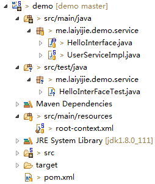
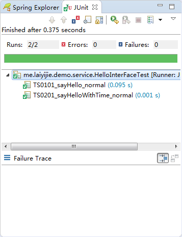
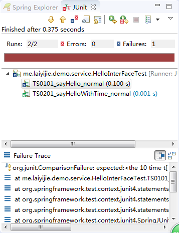

转载请注明来源 [赖赖的博客](http://laiyijie.me)

## 导语  
> 学习，先知骨架，再丰羽翼，先知其然，再知其所以然。  

要迅速解决问题，首先要有一个自己的框架知识库，例如，我知道Tomcat可以搭建web服务器，我知道Spring MVC可以构件web项目，我知道Mybatis可以控制持久层...  
这些是需要了解并且记在脑中的，至于详细的东西，等用的时候可以详细了解，此博客专题连载的Spring系列，就是送你一套框架知识库  
今天介绍单元测试，简单实例，让你知其然。  
<!-- more -->

## 实例

### 项目工程目录结构和代码获取地址

#### 获取地址（版本Log将会注明每一个版本对应的课程）
https://github.com/laiyijie/SpringLearning

#### 目录结构

#### 运行工程（与之前不同，请注意）  
##### 运行方式　　
- 右键HelloInterFaceTest.java
- Run as
- JUnit Test

##### 运行结果  
> init before every testcase  
> the 10 time to say userHello  
> clean after every testcase  
> init before every testcase  
> time:1480420925632 userHello  
> clean after every testcase  

### 项目详解

从HelloInterFaceTest.java入手（终于不是四行代码的App.java啦）  

#### HelloInterFaceTest.java  
	package me.laiyijie.demo.service;
	
	import org.junit.After;
	import org.junit.Before;
	import org.junit.FixMethodOrder;
	import org.junit.Test;
	import org.junit.runner.RunWith;
	import org.junit.runners.MethodSorters;
	import org.springframework.beans.factory.annotation.Autowired;
	import org.springframework.test.context.ContextConfiguration;
	import org.springframework.test.context.junit4.SpringJUnit4ClassRunner;
	
	import static org.junit.Assert.*;
	
	@RunWith(SpringJUnit4ClassRunner.class)
	@ContextConfiguration({ "classpath:root-context.xml" })
	@FixMethodOrder(MethodSorters.NAME_ASCENDING)
	public class HelloInterFaceTest {
	
		@Autowired
		private HelloInterface helloInterface;
	
		@Before
		public void init() {
			System.out.println("init before every testcase");
		}
	
		@After
		public void after() {
			System.out.println("clean after every testcase");
		}
	
		@Test
		public void TS0101_sayHello_normal() {
	
			int num = 10;
	
			String result = helloInterface.sayHello(num);
			
			System.out.println(result);
			
			String expect = "the " + num + " time to say userHello";
			
			assertEquals(expect, result);
		}
	
		@Test
		public void TS0201_sayHelloWithTime_normal() {
			
			String result = helloInterface.sayHelloWithTime();
			
			System.out.println(result);
		}
	}  

代码有点儿长？莫慌，长代码，一个套路，那就是叠砖！让我们仔细看看这块砖  

##### JUnit测试用例执行过程概述  

首先略过头部，直接看类里面的方法，其中两个函数分别被`@Before`和`@After`注解，两个函数被`@Test`注解。  
我们仔细看一下运行结果可以发现几个函数的执行顺序如下所示：  

1. `@Before` 注解的函数先执行
2. `@Test` 注解的`TS0101_sayHello_normal`执行
3. `@After` 注解的函数执行  
4. `@Before` 注解的函数先执行
5. `@Test` 注解的`TS0201_sayHelloWithTime_normal`执行
6. `@After` 注解的函数执行  

那么显而易见的结论：  
- `@Test`注释的函数会挨个执行（我们称这个函数为**测试用例**）  
- `@Before`注解的函数会在**每个**`@Test`注解的函数之 **前** 执行（我们使用这个注解进行测试用例前的初始化）  
- `@After` 注解的函数会在**每个**`@Test`注解的函数之 **后** 执行（我们使用这个注解进行测试用例后的清理）  

下面详细解读其余部分：  

**import先略过，只是一些依赖**  

之后从类前面的注解开始讲解  

##### Spring测试类前注解含义（启动Spring测试环境）  
	@RunWith(SpringJUnit4ClassRunner.class)
	@ContextConfiguration({ "classpath:root-context.xml" })
	@FixMethodOrder(MethodSorters.NAME_ASCENDING)

- `@RunWith(SpringJUnit4ClassRunner.class)` 提供了一个Spring的运行环境，说白了，就是可以在测试类中使用`@Autowired`等Spring注解，例如代码中的`private HelloInterface helloInterface;`就是使用`@Autowired`来注入，你完全可以理解为是`@Service`  
- `@ContextConfiguration({ "classpath:root-context.xml" })` 加载了`root-context.xml`（加载了才可以注入 `UserServiceImpl`实例嘛  
- `@FixMethodOrder(MethodSorters.NAME_ASCENDING)` 根据用例的函数名称升序执行用例（很实用，但是非必须）  

OK，三个注解解决了Spring+JUnit单元测试环境的配置。  

JUnit的三个注解，加上Spring Test环境的配置，测试用例就此简单起步。  
而在测试用例中，我们肯定不能通过`System.out.println`输出到控制台来进行判断（肉眼判断输出是否正确，很容易出现失误）  
在此我简单的介绍使用`Assert`类提供的方法判断输出是否正确  

#####　assertequals，跟肉眼say goodbye  

我们摘出这段代码：  

	@Test
	public void TS0101_sayHello_normal() {

		int num = 10;

		String result = helloInterface.sayHello(num);
		
		System.out.println(result);
		
		String expect = "the " + num + " time to say userHello";
		
		assertEquals(expect, result);
	}  

其中这句话：  

> assertEquals(expect, result);  

就这么简单，第一参数为`期望输出`第二个参数为`真实结果`。  

- 如果两者相等（equals)，用例通过（JUnit测试条为绿色）  

   

- 如果两者不等，用例失败（JUnit测试条为红色）  

   

##### pom.xml  

	<project xmlns="http://maven.apache.org/POM/4.0.0" xmlns:xsi="http://www.w3.org/2001/XMLSchema-instance"
		xsi:schemaLocation="http://maven.apache.org/POM/4.0.0 http://maven.apache.org/xsd/maven-4.0.0.xsd">
		<modelVersion>4.0.0</modelVersion>
	
		<groupId>me.laiyijie</groupId>
		<artifactId>demo</artifactId>
		<version>0.0.1-SNAPSHOT</version>
		<packaging>jar</packaging>
	
		<dependencies>
	
			<!-- https://mvnrepository.com/artifact/org.springframework/spring-context -->
			<dependency>
				<groupId>org.springframework</groupId>
				<artifactId>spring-context</artifactId>
				<version>4.3.2.RELEASE</version>
			</dependency>
			<!-- https://mvnrepository.com/artifact/org.springframework/spring-test -->
			<dependency>
				<groupId>org.springframework</groupId>
				<artifactId>spring-test</artifactId>
				<version>4.3.2.RELEASE</version>
				<scope>test</scope>
			</dependency>
			<!-- Test -->
			<dependency>
				<groupId>junit</groupId>
				<artifactId>junit</artifactId>
				<version>4.12</version>
				<scope>test</scope>
			</dependency>
			
		</dependencies>
	</project>

新增两个Scope为test的依赖，分别是  
- `spring-test` 提供`@RunWith`中的 `SpringJUnit4ClassRunner.class` 以及 `@ContextConfiguration` 
- `junit` 提供`@RunWith`，`@After`，`@Before`，`@Test`等

### 小结：  
- JUnit运行过程  
	- 通过`@RunWith(SpringJUnit4ClassRunner.class)`和`@ContextConfiguration({ "classpath:root-context.xml" })`配置Spring单元测试环境，使得  
		1. 加载`root-context.xml`配置的`ApplicationContext`  
		2. 使得`HelloInterFaceTest`（测试类）可以使用`@Autowired`装载容器中的`bean`  
	- 通过`@Before`实现测试用例运行前初始化
	- 通过`@Test`定义测试用例并且挨个执行
	- 通过`@After`实现测试用例完成后清理  

测试用例这么好写，何不多写几个？你的代码稳定性会提升一个层次！