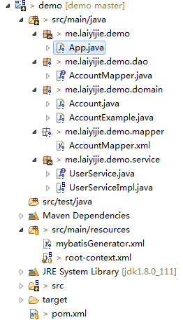
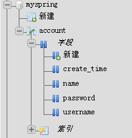
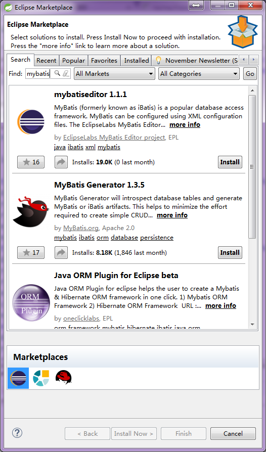

转载请注明来源 [赖赖的博客](http://laiyijie.me)

## 导语  
> 对接越多，耦合约松，系统越复杂。  

数据库的使用是不可避免的，在学习本章之前，你需要：

- 了解数据库的基本知识
- 使用过mysql数据库
- 熟悉SQL语句

<!-- more -->

## 实例

### 项目工程目录结构和代码获取地址

#### 获取地址（版本Log将会注明每一个版本对应的课程）
https://github.com/laiyijie/SpringLearning

#### 目录结构&数据库  

##### 工程目录结构  
  

##### 数据库 
  

创建语句：  
	CREATE TABLE `account` (
	  `username` varchar(45) NOT NULL,
	  `password` varchar(45) NOT NULL,
	  `name` varchar(45) NOT NULL,
	  `create_time` bigint(20) NOT NULL
	) ENGINE=MyISAM DEFAULT CHARSET=utf8;
	ALTER TABLE `account`
	  ADD PRIMARY KEY (`username`);

#### 运行工程（与之前不同，请注意）  
##### 运行方式　　
- 右键App.java
- Run as
- Java Application

##### 运行结果  
> Account [username=laiyijie, password=123456, name=赖赖, create_time=1480595033430]
> Account [username=laiyijie, password=123456, name=赖赖, create_time=1480595033430]

### 项目详解  

从 App.java 入手：

#### App.java  	
	package me.laiyijie.demo;
	
	import java.util.List;
	
	import org.springframework.context.support.ClassPathXmlApplicationContext;
	
	import me.laiyijie.demo.domain.Account;
	import me.laiyijie.demo.service.UserService;
	
	public class App {
	
		public static void main(String[] args) {
			ClassPathXmlApplicationContext context = new ClassPathXmlApplicationContext("root-context.xml");
	
			UserService service = context.getBean(UserService.class);
	
			Account account = service.createAccount("laiyijie", "123456", "赖赖");
	
			System.out.println(account);
	
			List<Account> accounts = service.getAccountsByCreateTime(0L, System.currentTimeMillis());
	
			for (Account account2 : accounts) {
				System.out.println(account2);
			}
	
			context.close();
		}
	
	}
	
	
- 加载`ApplicationContext`
- 取出`UserService`的实现对象
- 调用`UserService`的`createAccount`方法
- 输出`account`
- 调用`UserService`的`getAccountsByCreateTime`方法
- 循环输出`accounts`
- 关闭`ApplicationContext`  

`Account`类是一个纯数据类，也就是说，`Account`类中的字段与数据库中的字段完全对应：  

#### Account.java（没有给出 getter和setter以及toString方法）  
	package me.laiyijie.demo.domain;
	
	public class Account {
	    private String username;
	
	    private String password;
	
	    private String name;
	
	    private Long create_time;
	    
	}  
果然与数据库中的字段完全一样！！

	CREATE TABLE `account` (
	  `username` varchar(45) NOT NULL,
	  `password` varchar(45) NOT NULL,
	  `name` varchar(45) NOT NULL,
	  `create_time` bigint(20) NOT NULL
	) ENGINE=MyISAM DEFAULT CHARSET=utf8;  
那让我们继续看看UserService都定义了一些什么：
  
#### UserService.java  
	package me.laiyijie.demo.service;
	
	import java.util.List;
	
	import me.laiyijie.demo.domain.Account;
	
	public interface UserService {
		Account createAccount(String username ,String password,String name);
		List<Account> getAccountsByCreateTime(Long start,Long end);
	}  

定义了两个方法  
1. 创建账号  
2. 取出两个时间之间创建的所有账号  

其实现类为 `UserServiceImpl`  

#### UserServiceImpl.java    
	package me.laiyijie.demo.service;
	
	import java.util.List;
	
	import org.springframework.beans.factory.annotation.Autowired;
	import org.springframework.stereotype.Service;
	
	import me.laiyijie.demo.dao.AccountMapper;
	import me.laiyijie.demo.domain.Account;
	import me.laiyijie.demo.domain.AccountExample;
	
	@Service
	public class UserServiceImpl implements UserService {
	
		@Autowired
		private AccountMapper accountMapper;
		
		public Account createAccount(String username, String password, String name) {
			
			Account account = new Account();
			account.setCreate_time(System.currentTimeMillis());
			account.setName(name);
			account.setPassword(password);
			account.setUsername(username);
			
			accountMapper.insert(account);
			return account;
		}
	
		public List<Account> getAccountsByCreateTime(Long start, Long end) {
			AccountExample accountExample = new AccountExample();
			accountExample.or().andCreate_timeGreaterThan(start).andCreate_timeLessThanOrEqualTo(end);
			return accountMapper.selectByExample(accountExample);
		}
	}
	
关键来了！  
此处引入了依赖 `private AccountMapper accountMapper` 并且调用了此接口的一些方法！

我们不妨看一下这个类：  

#### AccountMapper.java  
	package me.laiyijie.demo.dao;
	
	import java.util.List;
	import me.laiyijie.demo.domain.Account;
	import me.laiyijie.demo.domain.AccountExample;
	import org.apache.ibatis.annotations.Param;
	
	public interface AccountMapper {
	    long countByExample(AccountExample example);
	
	    int deleteByExample(AccountExample example);
	
	    int deleteByPrimaryKey(String username);
	
	    int insert(Account record);
	
	    int insertSelective(Account record);
	
	    List<Account> selectByExample(AccountExample example);
	
	    Account selectByPrimaryKey(String username);
	
	    int updateByExampleSelective(@Param("record") Account record, @Param("example") AccountExample example);
	
	    int updateByExample(@Param("record") Account record, @Param("example") AccountExample example);
	
	    int updateByPrimaryKeySelective(Account record);
	
	    int updateByPrimaryKey(Account record);
	}  

可以看到，`AccountMapper`定义了对Account数据表的所有操作（CRUD），其中有一部分以`ByExample`结尾的不容易理解，我们详细讲解！  

##### List<Account> selectByExample(AccountExample example)  

我们看其用法：  
	public List<Account> getAccountsByCreateTime(Long start, Long end) {
		AccountExample accountExample = new AccountExample();
		accountExample.or().andCreate_timeGreaterThan(start).andCreate_timeLessThanOrEqualTo(end);
		return accountMapper.selectByExample(accountExample);
	}  

这段代码摘自`UserServiceImpl`中，这个方法的目的是`取出start到end时间内创建的所有账号`  

`AccountExample`的目的是为了组合一个`where`语句，其组合出的语句结构如下 `where（xxx and xxx）or （xxx and xxx）`   
所以:  
> accountExample.or().andCreate_timeGreaterThan(start).andCreate_timeLessThanOrEqualTo(end);  
等于  
> where create_time > xxx and create_time<=xxx 

如果进一步的，我们增加一行代码`accountExample.or().andUsernameEqualTo("laiyijie");`
  
那么就是相当于:  
> accountExample.or().andCreate_timeGreaterThan(start).andCreate_timeLessThanOrEqualTo(end); 
> accountExample.or().andUsernameEqualTo("laiyijie");  
> 等于  
> where (create_time > xxx and create_time<=xxx) or username="laiyijie"  

就是如此简单！相信信息可以查看[MybatisGenerator关于Example使用的文档](http://www.mybatis.org/generator/generatedobjects/exampleClassUsage.html)

说了这么多，是不是还是觉得代码太多？  
其实`me.laiyijie.demo.dao`、`me.laiyijie.demo.domain`和`me.laiyijie.demo.Mapper`都是自动生成的。 这个神器就是`MybatisGenerator`。

也就是说，在现在这个项目中，其实我只书写了`UserService.java`、`UserServiceImpl.java`和`App.java`三个类！  

#### MybatisGenerator（创建 domain，mapper，dao，Example对象，ORM自动解决）  

介绍一下怎么使用MybatisGenerator（[官方文档位置](http://www.mybatis.org/generator/index.html)）  

- 下载MybatisGenerator的Eclipse插件
	- 打开MarketPlace并搜索mybatis并且安装  

- 配置mybatisGenerator.xml（用于配置如何生成源文件） 
##### mybatisGenerator.xml  
	
	<?xml version="1.0" encoding="UTF-8"?>
	<!DOCTYPE generatorConfiguration PUBLIC
	  "-//mybatis.org//DTD MyBatis Generator Configuration 1.0//EN"
	  "http://mybatis.org/dtd/mybatis-generator-config_1_0.dtd">
	<generatorConfiguration>
		<!-- 填写mysql-connector-java的驱动类 -->
		<classPathEntry
			location="C:\Users\admin\.m2\repository\mysql\mysql-connector-java\5.1.38\mysql-connector-java-5.1.38.jar" />
	
		<context id="context1">
				<commentGenerator>
	            <!-- 是否去除自动生成的注释 true：是 ： false:否 -->
	            <property name="suppressAllComments" value="true" />
	        </commentGenerator>
			<!-- 配置连接类和数据库账号密码 -->
			<jdbcConnection connectionURL="jdbc:mysql://127.0.0.1:3306/myspring"
				driverClass="com.mysql.jdbc.Driver" userId="test" password="o34rWayJPPHgudtL"/>
				
	
			<!-- 配置生成类的存放包名 -->
			<javaModelGenerator targetPackage="me.laiyijie.demo.domain"
				targetProject="demo" />
			<sqlMapGenerator targetPackage="me.laiyijie.demo.mapper"
				targetProject="demo" />
			<javaClientGenerator targetPackage="me.laiyijie.demo.dao"
				targetProject="demo" type="XMLMAPPER" />
			
			<!-- 需要生成表 -->
			<table schema="myspring" tableName="account" domainObjectName="Account">
				<property name="useActualColumnNames" value="true" />
			</table>
			
		</context>
	</generatorConfiguration>  

- 右键`mybatisGenerator.xml`> Run as> Mybatis Generator 生成成功！  

详细配置请参考[MybatisGenerator官方文档](http://www.mybatis.org/generator/index.html)  

下面这一步就是配置Spring连接数据库：  

#### root-context.xml  
	
	<?xml version="1.0" encoding="UTF-8"?>
	<beans xmlns="http://www.springframework.org/schema/beans"
		xmlns:xsi="http://www.w3.org/2001/XMLSchema-instance" xmlns:context="http://www.springframework.org/schema/context"
		xmlns:aop="http://www.springframework.org/schema/aop" xmlns:task="http://www.springframework.org/schema/task"
		xmlns:p="http://www.springframework.org/schema/p"
		xsi:schemaLocation="http://www.springframework.org/schema/task http://www.springframework.org/schema/task/spring-task-4.3.xsd
			http://www.springframework.org/schema/beans http://www.springframework.org/schema/beans/spring-beans.xsd
			http://www.springframework.org/schema/context http://www.springframework.org/schema/context/spring-context-4.3.xsd
			http://www.springframework.org/schema/aop http://www.springframework.org/schema/aop/spring-aop-4.3.xsd">
	
		<context:component-scan base-package="me.laiyijie.demo"></context:component-scan>
	
		<bean id="mysqlDataSource" class="org.apache.commons.dbcp.BasicDataSource"
			p:driverClassName="com.mysql.jdbc.Driver"
			p:url="jdbc:mysql://127.0.0.1:3306/myspring"
			p:username="test" p:password="o34rWayJPPHgudtL" />
			
		<bean id="sqlSessionFactory" class="org.mybatis.spring.SqlSessionFactoryBean"
			p:dataSource-ref="mysqlDataSource" p:mapperLocations="classpath:me/laiyijie/demo/mapper/*.xml" />
	
		<bean class="org.mybatis.spring.mapper.MapperScannerConfigurer"
			p:sqlSessionFactoryBeanName="sqlSessionFactory" p:basePackage="me.laiyijie.demo.dao" />
	
	</beans>  

新增的配置的解释如下：  
- 配置数据源（数据库账密等）  

	<bean id="mysqlDataSource" class="org.apache.commons.dbcp.BasicDataSource"
		p:driverClassName="com.mysql.jdbc.Driver"
		p:url="jdbc:mysql://127.0.0.1:3306/myspring"
		p:username="test" p:password="o34rWayJPPHgudtL" />  

- 配置`Mybatis`的`sqlSessionFactory`和`MapperScannerConfigurer`（其实就是用于扫描所有`*.xml`配置文件并且生成与接口`*Mapper`对应的实现类的Bean，这也是为什么可以使用`@Autowired`来加载`AccountMapper`这个接口的原因！  

		<bean id="sqlSessionFactory" class="org.mybatis.spring.SqlSessionFactoryBean"
		p:dataSource-ref="mysqlDataSource" p:mapperLocations="classpath:me/laiyijie/demo/mapper/*.xml" />  

		<bean class="org.mybatis.spring.mapper.MapperScannerConfigurer"
			p:sqlSessionFactoryBeanName="sqlSessionFactory" p:basePackage="me.laiyijie.demo.dao" />  

三条配置，一点儿也不麻烦！

#### pom.xml  
	
	<project xmlns="http://maven.apache.org/POM/4.0.0" xmlns:xsi="http://www.w3.org/2001/XMLSchema-instance"
		xsi:schemaLocation="http://maven.apache.org/POM/4.0.0 http://maven.apache.org/xsd/maven-4.0.0.xsd">
		<modelVersion>4.0.0</modelVersion>
	
		<groupId>me.laiyijie</groupId>
		<artifactId>demo</artifactId>
		<version>0.0.1-SNAPSHOT</version>
		<packaging>jar</packaging>
	
		<dependencies>
	
			<!-- https://mvnrepository.com/artifact/org.springframework/spring-context -->
			<dependency>
				<groupId>org.springframework</groupId>
				<artifactId>spring-context</artifactId>
				<version>4.3.2.RELEASE</version>
			</dependency>
	
			<!-- https://mvnrepository.com/artifact/org.springframework/spring-jdbc -->
			<dependency>
				<groupId>org.springframework</groupId>
				<artifactId>spring-jdbc</artifactId>
				<version>4.3.2.RELEASE</version>
			</dependency>
	
			<!-- mybatis-Spring -->
			<dependency>
				<groupId>org.mybatis</groupId>
				<artifactId>mybatis-spring</artifactId>
				<version>1.3.0</version>
			</dependency>
			<!-- https://mvnrepository.com/artifact/org.mybatis/mybatis -->
			<dependency>
				<groupId>org.mybatis</groupId>
				<artifactId>mybatis</artifactId>
				<version>3.4.1</version>
			</dependency>
	
			<!-- https://mvnrepository.com/artifact/commons-dbcp/commons-dbcp -->
			<dependency>
				<groupId>commons-dbcp</groupId>
				<artifactId>commons-dbcp</artifactId>
				<version>1.4</version>
			</dependency>
	
			<!-- https://mvnrepository.com/artifact/mysql/mysql-connector-java -->
			<dependency>
				<groupId>mysql</groupId>
				<artifactId>mysql-connector-java</artifactId>
				<version>5.1.38</version>
			</dependency>
		</dependencies>
	</project>

新增依赖： 
- spring-jdbc spring对数据库查询的支持
- commons-dbcp 配置数据源中的`org.apache.commons.dbcp.BasicDataSource`来源，数据连接池
- mybatis-spring `root-context.xml` 中的使用的两个类出自这里
- mybatis mybatis框架
- mysql-connector-java 连接mysql数据库用的驱动

### 附： 

#### 数据源配置建议如下（解决Mysql八小时问题以及utf-8编码问题）：  
	<bean id="mysqlDataSource" class="org.apache.commons.dbcp.BasicDataSource"
		destroy-method="close" p:driverClassName="com.mysql.jdbc.Driver"
		p:url="jdbc:mysql://127.0.0.1:3306/myspring?useUnicode=true&amp;characterEncoding=utf8"
		p:username="test" p:password="o34rWayJPPHgudtL" p:testWhileIdle="true"
		p:testOnBorrow="false" p:validationQuery="SELECT 1"
		p:timeBetweenEvictionRunsMillis="7200000" p:numTestsPerEvictionRun="50" />