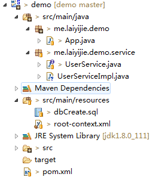
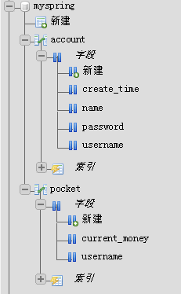

转载请注明来源 [赖赖的博客](http://laiyijie.me)

## 导语 
> 只要你肯再坚持一会儿，就会发现世界如此简单。  

事务管理在持久层（数据库）操作中是不可或缺的，其主要目的是为了保证操作的完整性。  
而Spring提供了强大的声明式事务管理的方式，其实现原理是采用了AOP对方法进行增强，使用起来非常方便，再也不用自己去管理事务（TRANSACTION）  

<!-- more -->

## 实例

### 项目工程目录结构和代码获取地址

#### 获取地址（版本Log将会注明每一个版本对应的课程）
https://github.com/laiyijie/SpringLearning

#### 目录结构&数据库  

##### 工程目录结构  
  

##### 数据库 
  

创建语句：  

	CREATE TABLE account (
		username varchar(45) NOT NULL,
		password varchar(45) NOT NULL,
		name varchar(45) NOT NULL,
		create_time bigint(20) NOT NULL
	) ENGINE=InnoDB DEFAULT CHARSET=utf8;
	ALTER TABLE account
	ADD PRIMARY KEY (username);
	
	CREATE TABLE `pocket` (
	  `username` varchar(45) NOT NULL,
	  `current_money` int(11) NOT NULL
	) ENGINE=InnoDB DEFAULT CHARSET=utf8;
	ALTER TABLE `pocket`
	  ADD PRIMARY KEY (`username`);
	

#### 运行工程 
##### 运行方式　　
- 右键App.java
- Run as
- Java Application

##### 运行结果 

> Exception in thread "main" java.lang.RuntimeException: lailai

数据库新增两条记录：  

- account表中新增一条

- pocket表中新增一条  
  

### 项目详解  

#### App.java  
	
	package me.laiyijie.demo;
	
	import org.springframework.context.support.ClassPathXmlApplicationContext;
	
	import me.laiyijie.demo.service.UserService;
	
	public class App {
	
		public static void main(String[] args) throws Exception {
			ClassPathXmlApplicationContext context = new ClassPathXmlApplicationContext("root-context.xml");
	
			UserService service = context.getBean(UserService.class);
			
			service.createAccount("laiyijie", "123123", "lai");
			
			service.createAccount("lailai", "123123", "lai");
			
			context.close();
		}
	
	}  

有两条`createAccount`语句，却只产生了一个账号！问题肯定出现在`createAccount`方法中  

我们来具体看下`UserService` 的实现类  

#### UserServiceImpl.java  
	package me.laiyijie.demo.service;
	
	import java.sql.Connection;
	
	import org.apache.commons.dbcp.BasicDataSource;
	import org.springframework.beans.factory.annotation.Autowired;
	import org.springframework.jdbc.datasource.DataSourceUtils;
	import org.springframework.stereotype.Service;
	import org.springframework.transaction.annotation.Transactional;
	
	@Service
	public class UserServiceImpl implements UserService {
	
		@Autowired
		private BasicDataSource dataSource;
	
		@Transactional
		public void createAccount(String username, String password, String name) throws Exception {
	
			Connection connection = DataSourceUtils.getConnection(dataSource);
	
			connection.createStatement().execute("INSERT INTO account (username, password, name,create_time) VALUES('"
					+ username + "','" + password + "','" + name + "','" + System.currentTimeMillis() + "')");
	
			if (username == "lailai") {
				throw new RuntimeException("lailai");
			}
	
			connection.createStatement()
					.execute("INSERT INTO pocket (username,current_money) VALUES('" + username + "','" + 0 + "')");
	
		}
	
	}
函数执行过程：  

- 通过`DataSourceUtils.getConnection`从`dataSource`中获取connection  

> Connection connection = DataSourceUtils.getConnection(dataSource);  

- 执行插入`account`表的insert语句  
> connection.createStatement().execute("INSERT INTO account (username, password, name,create_time) VALUES('"
					+ username + "','" + password + "','" + name + "','" + System.currentTimeMillis() + "')"); 

- 判断是否用户名为`lailai`，是的话抛出`运行时错误`  
>  if (username == "lailai") {
	throw new RuntimeException("lailai");
	}

- 执行插入`pocket`表的insert语句 
> connection.createStatement()
					.execute("INSERT INTO pocket (username,current_money) VALUES('" + username + "','" + 0 + "')");

那么很明显，在`main`函数中执行第二次`createAccount`的过程中，抛出了错误，而抛出错误的时间是在执行完**插入account表**之后！ 
 
理论上讲，在抛错之前的所有语句都应该被执行，也就是说，我们应该向数据库中插入了三行数据，两条`account`数据，一条`pocket`数据，然而却只有一条`account`数据和一条`pocket`数据。  

让我们看看`lailai`这条`account`数据去哪儿了。  

##### @Transactional 注解（spring的事务管理）  

细心的读者可以发现，在`createAccount`函数之前我们增加了一个注解`@Transactional`，这个是Spring事务管理的声明，其寓意为：  

> 当执行`createAccount`的时候，将创建一个事务，函数执行成功，则正常提交，当函数抛出`RuntimeExeption`的时候则回滚  

这里有几个隐含的条件非常重要：  

- 数据库连接的获取一定要通过 `DataSourceUtils.getConnection` 来获取。每一个事务都是绑定在一个连接上的，如果还是通过 `datasource.getConnection`方法获取连接则有可能是获取到别的连接（由于连接池的存在）而`DataSourceUtils.getConnection` 获取的连接是当前事务的连接  
- 只有将异常抛出才能产生回滚，如果使用`try catch`处理了异常是不能回滚的
- 默认情况下只有`RuntimeException`的抛出会产生回滚，如果需要自行定义可以回滚的异常，可以通过增加`RollbackFor`属性： 
	- 	@Transactional(rollbackFor={Exception.class})
- 如果使用mysql数据库，请不要用 MyISAM引擎，因为不支持事务，请使用InnoDB引擎  

说了这么多限制，那么到底应该如何在Spring中配置事务呢：  

#### root-context.xml  

	<?xml version="1.0" encoding="UTF-8"?>
	<beans xmlns="http://www.springframework.org/schema/beans"
		xmlns:xsi="http://www.w3.org/2001/XMLSchema-instance" xmlns:context="http://www.springframework.org/schema/context"
		xmlns:p="http://www.springframework.org/schema/p" xmlns:tx="http://www.springframework.org/schema/tx"
		xsi:schemaLocation="http://www.springframework.org/schema/task http://www.springframework.org/schema/task/spring-task-4.3.xsd
			http://www.springframework.org/schema/beans http://www.springframework.org/schema/beans/spring-beans.xsd
			http://www.springframework.org/schema/context http://www.springframework.org/schema/context/spring-context-4.3.xsd
			http://www.springframework.org/schema/aop http://www.springframework.org/schema/aop/spring-aop-4.3.xsd
			http://www.springframework.org/schema/tx http://www.springframework.org/schema/tx/spring-tx-4.3.xsd">
	
	
		<bean id="mysqlDataSource" class="org.apache.commons.dbcp.BasicDataSource"
			p:driverClassName="com.mysql.jdbc.Driver" p:url="jdbc:mysql://127.0.0.1:3306/myspring"
			p:username="test" p:password="o34rWayJPPHgudtL" />
	
		<bean id="transactionManager"
			class="org.springframework.jdbc.datasource.DataSourceTransactionManager"
			p:dataSource-ref="mysqlDataSource" />
			
		<tx:annotation-driven transaction-manager="transactionManager" />
	
		<context:component-scan base-package="me.laiyijie.demo"></context:component-scan>
	
	</beans>  

增加了两个配置：  

- 配置TransactionManager  

		<bean id="transactionManager"
		class="org.springframework.jdbc.datasource.DataSourceTransactionManager"
		p:dataSource-ref="mysqlDataSource" />  
- 开启注解驱动  

		<tx:annotation-driven transaction-manager="transactionManager" />

#### pom.xml  

	<project xmlns="http://maven.apache.org/POM/4.0.0" xmlns:xsi="http://www.w3.org/2001/XMLSchema-instance"
		xsi:schemaLocation="http://maven.apache.org/POM/4.0.0 http://maven.apache.org/xsd/maven-4.0.0.xsd">
		<modelVersion>4.0.0</modelVersion>
	
		<groupId>me.laiyijie</groupId>
		<artifactId>demo</artifactId>
		<version>0.0.1-SNAPSHOT</version>
		<packaging>jar</packaging>
	
		<dependencies>
	
			<!-- https://mvnrepository.com/artifact/org.springframework/spring-context -->
			<dependency>
				<groupId>org.springframework</groupId>
				<artifactId>spring-context</artifactId>
				<version>4.3.2.RELEASE</version>
			</dependency>
	
			<!-- https://mvnrepository.com/artifact/org.springframework/spring-jdbc -->
			<dependency>
				<groupId>org.springframework</groupId>
				<artifactId>spring-jdbc</artifactId>
				<version>4.3.2.RELEASE</version>
			</dependency>
	
			<!-- https://mvnrepository.com/artifact/commons-dbcp/commons-dbcp -->
			<dependency>
				<groupId>commons-dbcp</groupId>
				<artifactId>commons-dbcp</artifactId>
				<version>1.4</version>
			</dependency>
	
			<!-- https://mvnrepository.com/artifact/mysql/mysql-connector-java -->
			<dependency>
				<groupId>mysql</groupId>
				<artifactId>mysql-connector-java</artifactId>
				<version>5.1.38</version>
			</dependency>
	
	
	
		</dependencies>
	</project>
	
无需增加额外依赖！ spring-context中自带！ 

