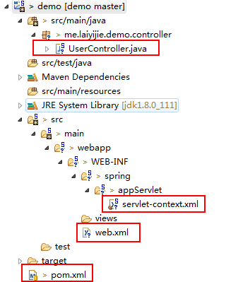

转载请注明来源 [赖赖的博客](http://laiyijie.me)

## 导语 
> 了解一下起因经过，你才能明白世事的真正含义。  

Spring的基础都了解了一些，这一篇就来看看Spring应用MVC会是怎么样的吧，轻松简单，本章讲述的是一次访问开始到返回Spring MVC是如何应对的（基础版）  

<!-- more -->

## 实例

### 项目工程目录结构和代码获取地址

#### 获取地址（版本Log将会注明每一个版本对应的课程）
https://github.com/laiyijie/SpringLearning

#### 目录结构  

  

如图所示，虽然目录结构看起来复杂了一些（就是文件夹深度深了一点儿而已），其实最源文件只有**四个**。所以不要紧张，这非常简单  

#### 运行工程 
##### 运行方式　　
- 右键**整个项目**
- Run as
- Run On Server
- 选择STS默认的 Pivotal Server（有tomcat也一样）并确认
- 在浏览器里输入 http://localhost:8080/**demo**/hi （demo是工程的名称，依照你的来替换） 

##### 运行结果 
  

我用的是 chrome浏览器，输出了**hello**  

OK，这次从浏览器输入这个链接到返回这个hello来讲解！  

### 项目详解  

我们不妨直接找找这个输出的 `hello`来自哪一段代码  

#### UserController.java  
	
	package me.laiyijie.demo.controller;
	
	import org.springframework.stereotype.Controller;
	import org.springframework.web.bind.annotation.RequestMapping;
	import org.springframework.web.bind.annotation.ResponseBody;
	
	@Controller
	public class UserController {
		
		@RequestMapping("/hi")
		@ResponseBody
		public String hello(){
			return "hello";
		}
		
	}

是不是很短，简洁明了！  

我们一眼看到的就是 `hello`！没错，就是这个函数里面处理了刚才的请求，并且返回了一个`hello`的字符串！  
这里有三个注解含义分别如下：  

- @Controller 将一个类变成一个特殊的`java bean`作为控制器使用，可以认为是特殊的`@Service`  
- @RequestMapping 这里面就是针对URL的控制，我们可以看到访问的URL/demo为项目名称，而/hi就代表的是访问由这个函数来控制！  
- @ResponseBody 将`hello`这个字符串直接返回给浏览器（不增加这个注解的情况下是返回一个对应的jsp页面-例如hello.jsp）  
   
进入到/demo以后是由`@RequestMapping`控制这个访问，那么一个访问是怎么被引到如到demo这个工程中的呢？Spring Context又是怎么生效的呢？（我们并没有用`new ClassPathXmlApplicationContext("root-context.xml"); `来初始化一个Spring Context，为何注解就用了起来？）

#### 浏览器中输入 http://localhost:8080/demo/hi 并访问   

- 浏览器访问 **localhost** 的 **8080** 端口  
- **localhost**的8080端口由Pivotal Server（或者tomcat，刚才你运行的时候开启的一个程序）监听  
- Server 接收到浏览器的请求并查看到路径为**/demo**，转交到**demo**工程来管理  
- 访问进入**demo** 这个工程后会先根据 **web.xml** 来确认入口是哪儿（这是tomcat等web容器一个通用的标准）  

那让我们详细看一下web.xml是怎样的！  

#### web.xml  
	
	<?xml version="1.0" encoding="UTF-8"?>
	<web-app xmlns:xsi="http://www.w3.org/2001/XMLSchema-instance"
		xsi:schemaLocation="http://xmlns.jcp.org/xml/ns/javaee 
	                http://xmlns.jcp.org/xml/ns/javaee/web-app_3_1.xsd"
		version="3.1" xmlns="http://xmlns.jcp.org/xml/ns/javaee">
	
		<servlet>
			<servlet-name>appServlet</servlet-name>
			<servlet-class>org.springframework.web.servlet.DispatcherServlet</servlet-class>
			<init-param>
				<param-name>contextConfigLocation</param-name>
				<param-value>/WEB-INF/spring/appServlet/servlet-context.xml</param-value>
			</init-param>
			<load-on-startup>1</load-on-startup>
		</servlet>
	
		<servlet-mapping>
			<servlet-name>appServlet</servlet-name>
			<url-pattern>/</url-pattern>
		</servlet-mapping>
		
	</web-app>
	
如果你不熟悉web.xml的配置，也请不要紧张，因为这部分的配置已经非常成熟，一次配置完毕会很少改动，即使你不太了解也不会影响你的使用，这里摆出只是为了让你了解一个访问是如何进入**Spring MVC**进行管理的。  

我们看关键一点：  

	<param-name>contextConfigLocation</param-name>
	<param-value>/WEB-INF/spring/appServlet/servlet-context.xml</param-value>  

这里载入了一个配置文件，这个配置文件的名称是 **servlet-context.xml** 这么熟悉的名称，正是SpringContext的配置文件！  

是的，正是通过**web.xml**我们初始化了一个**SpringContext**，也就是**tomcat**（或者Pivotal Server）帮助我们初始化了这个**SpringContext**代替掉我们再main函数中使用的：  

	ClassPathXmlApplicationContext context = new ClassPathXmlApplicationContext("root-context.xml"); 

Spring 容器初始化完毕，访问完全转入Spring MVC 中由我们进行控制！  

为了让注解生效必然要配置一下 servlet-context.xml  

#### servlet-context.xml  

	<?xml version="1.0" encoding="UTF-8"?>
	<beans xmlns="http://www.springframework.org/schema/beans"
		xmlns:xsi="http://www.w3.org/2001/XMLSchema-instance"
		xmlns:mvc="http://www.springframework.org/schema/mvc"
		xmlns:context="http://www.springframework.org/schema/context"
		xmlns:p="http://www.springframework.org/schema/p"
		xsi:schemaLocation="http://www.springframework.org/schema/mvc http://www.springframework.org/schema/mvc/spring-mvc.xsd
			http://www.springframework.org/schema/beans http://www.springframework.org/schema/beans/spring-beans.xsd
			http://www.springframework.org/schema/context http://www.springframework.org/schema/context/spring-context-4.3.xsd">
	
	
		<context:component-scan base-package="me.laiyijie.demo" />
	
		<mvc:annotation-driven />
	
		<bean
			class="org.springframework.web.servlet.mvc.method.annotation.RequestMappingHandlerAdapter"
			p:messageConverters-ref="stringHttpMessageConverter" />
	
		<bean id="stringHttpMessageConverter"
			class="org.springframework.http.converter.StringHttpMessageConverter" />
	
	</beans>
	

重点只有四句话：  

- 开启注解，扫描所有注解的组件（使得`@Controller`可以被实例化）
> <context:component-scan base-package="me.laiyijie.demo" />  

- 开启mvc注解驱动，使得`@RequestMapping`有效  
> <mvc:annotation-driven />  

- 最后两句配置适配器使得返回的`hello`正常输出  

#### pom.xml  
	<project xmlns="http://maven.apache.org/POM/4.0.0" xmlns:xsi="http://www.w3.org/2001/XMLSchema-instance"
		xsi:schemaLocation="http://maven.apache.org/POM/4.0.0 http://maven.apache.org/xsd/maven-4.0.0.xsd">
		<modelVersion>4.0.0</modelVersion>
	
		<groupId>me.laiyijie</groupId>
		<artifactId>demo</artifactId>
		<version>0.0.1-SNAPSHOT</version>
		<packaging>war</packaging>
	
		<properties>
			<maven.compiler.source>1.8</maven.compiler.source>
			<maven.compiler.target>1.8</maven.compiler.target>
			<maven.compiler.compilerVersion>1.8</maven.compiler.compilerVersion>
		</properties>
	
		<dependencies>
	
			<!-- https://mvnrepository.com/artifact/org.springframework/spring-context -->
			<dependency>
				<groupId>org.springframework</groupId>
				<artifactId>spring-context</artifactId>
				<version>4.3.2.RELEASE</version>
			</dependency>
	
			<dependency>
				<groupId>org.springframework</groupId>
				<artifactId>spring-webmvc</artifactId>
				<version>4.3.2.RELEASE</version>
			</dependency>
	
		</dependencies>
	
		<build>
			<plugins>
				<plugin>
					<groupId>org.apache.maven.plugins</groupId>
					<artifactId>maven-compiler-plugin</artifactId>
					<version>3.1</version>
					<configuration>
						<source>1.8</source>
						<target>1.8</target>
					</configuration>
				</plugin>
			</plugins>
		</build>
	</project>
	
	
依赖新增一个：  

	<dependency>
		<groupId>org.springframework</groupId>
		<artifactId>spring-webmvc</artifactId>
		<version>4.3.2.RELEASE</version>
	</dependency> 

### 小结：  

输入 http://localhost:8080/demo/hi 访问全程：  

- 访问 `localhost`服务器的`8080`端口 
- 服务器监听`8080`端口的webserver接收到请求  
- 通过URL发现请求应该转入`/demo`这个工程处理  
- 请求通过标准配置`web.xml`确认了接受请求的程序为 appServelet  
- appServelet启动了一个由`servlet-context.xml`配置的Spring Context
- `servlet-context.xml`配置了由注解驱动，也就是通过`@RequestMapping`来确认访问应该分配到哪儿  
- `UserController` 中的 `hello`方法配置了`@RequestMapping("/hi")` 也就是说，该请求由这个函数处理，函数处理请求完毕返回`hello`，hello这个字符串通过`servlet-context.xml`中配置的转换器转换后输出到浏览器  

