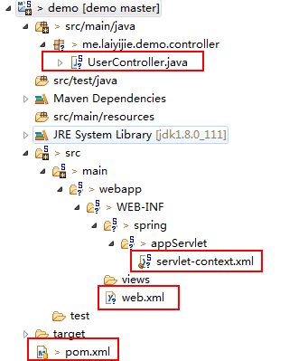
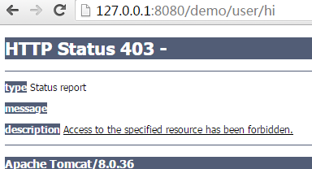
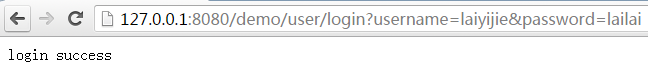
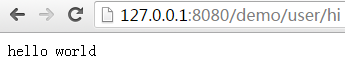

转载请注明来源 [赖赖的博客](http://laiyijie.me)

## 导语 

> 核心思想明了，骨架已经建立，就可以一点一点的丰满细节，反哺骨架和核心思想  

前面介绍了Spring MVC 是怎么接受一个访问的，想必你已经明白了基本的访问过程，作为一个应用系统，可能登录模块都必不可少，不妨今天就来做一个简单的登录模块，顺便熟悉一下Spring MVC的访问入参获取和拦截器的使用  

<!-- more -->

## 实例

### 项目工程目录结构和代码获取地址

#### 获取地址（版本Log将会注明每一个版本对应的课程）
https://github.com/laiyijie/SpringLearning

#### 目录结构  

  

如图所示，虽然目录结构看起来复杂了一些（就是文件夹深度深了一点儿而已），其实最源文件只有**五个**。所以不要紧张，这非常简单，而且相比上一课，只多出了一个文件，和少量的配置   

#### 运行工程 
##### 运行方式　　
- 右键**整个项目**
- Run as
- Run On Server
- 在浏览器里依次输入  （demo是工程的名称，依照你的来替换） 
	- http://localhost:8080/**demo**/user/hi
	- http://127.0.0.1:8080/**demo**/user/login?username=laiyijie&password=lailai
	- http://127.0.0.1:8080/**demo**/user/hi  
  
##### 运行结果  
- http://localhost:8080/**demo**/user/hi  
  

- http://127.0.0.1:8080/**demo**/user/login?username=laiyijie&password=lailai  
  

- http://127.0.0.1:8080/**demo**/user/hi  
  

第一次和最后一次的输入是完全一样的确实完全不同的两个结果？  

由于第一次没有登录，然后返回的是**403**权限不足，第二次是登录以后访问这个链接，可以正常返回。  

### 项目详解  

依照上一章的知识，访问会被引流到由`@RequestMapping`注解的函数执行，我们不妨直接找到`UserController`这个文件，访问是由这个控制器进行处理的 

#### UserController.java（与上一课有变化）  
	
	package me.laiyijie.demo.controller;
	
	import org.springframework.stereotype.Controller;
	import javax.servlet.http.HttpSession;
	import org.springframework.web.bind.annotation.RequestMapping;
	import org.springframework.web.bind.annotation.RequestParam;
	import org.springframework.web.bind.annotation.ResponseBody;
	
	@Controller
	@RequestMapping("/user")
	public class UserController {
	
		@RequestMapping("/hi")
		@ResponseBody
		public String hello(@RequestParam(value = "name", defaultValue = "world") String name) {
			return "hello " + name;
		}
	
		@RequestMapping("/login")
		@ResponseBody
		public String login(@RequestParam("username") String username, @RequestParam("password") String password,
				HttpSession httpsession) {
			if ("laiyijie".equals(username) && "lailai".equals(password)) {
				httpsession.setAttribute("username", username);
				return "login success";
			}
			return "loging failed";
		}
	
	}  

代码有几处变化：  

- 在类前面多了一个`@RequestMapping`注解，根据前面的执行结果可以知道，如果`@RequestMapping`注解应用到类上，那么**这个类中的所有方法的URL都增加这个注解的前缀**，在这个例子中，都增加了 `/user`，所以原来的`/hi`变成了`/user/hi`  
- 在方法参数中增加了由`@RequestParam`标注的入参，该参数就是映射入参  
	- 在第二次访问的时候我们使用的URL为`127.0.0.1/demo/user/login?username=laiyijie&password=lailai` 而其对应的函数声明有如下两个参数`@RequestParam("username") String username, @RequestParam("password") String password` 
	- 显而易见的，`@RequestParam`获取了问号后面的键值对参数  
	- 在`hi`这个函数中我们这样使用`@RequestParam(value = "name", defaultValue = "world") String name` 设置了一个默认值，这样的话即使我们不传这个参数也会返回 `hello world`（例如第三次访问）  
- `login`函数中新增了一个`HttpSession`的入参  
	- 首先，这个入参从何而来？这是SpringMVC在使用`DispatcherServlet`分配URL对应控制器的时候会根据函数声明自动注入的一个参数，相应的还可以参考[官方文档](http://docs.spring.io/spring/docs/current/spring-framework-reference/htmlsingle/#mvc-ann-methods)  
	- 作用很简单就是获取当前的`HttpSession`从而可以操作`Session`中的属性（Session在这个例子中是为了保存登录状态）
- `login`函数中，在用户名和密码正确以后除了会返回`login success`以外还会设置一个名为`username`的`Session`属性用来证明登录成功  

那么问题来了，在第一次访问`/uesr/hi`的时候是怎么会返回`403`错误的呢？  

这就要引入Spring MVC的一个重要组件，**拦截器**（Interceptor）  

#### LoginInterceptor.java（新增）  
	
	package me.laiyijie.demo.controller;
	
	import javax.servlet.http.HttpServletRequest;
	import javax.servlet.http.HttpServletResponse;
	
	import org.springframework.web.servlet.HandlerInterceptor;
	import org.springframework.web.servlet.ModelAndView;
	
	public class LoginInterceptor implements HandlerInterceptor {
	
		@Override
		public boolean preHandle(HttpServletRequest request, HttpServletResponse response, Object handler)
				throws Exception {
			String username = (String) request.getSession().getAttribute("username");
			if (username != null) {
				return true;
			}else{
				response.sendError(403);
				return false;
			}
		}
	
		@Override
		public void postHandle(HttpServletRequest request, HttpServletResponse response, Object handler,
				ModelAndView modelAndView) throws Exception {
	
		}
	
		@Override
		public void afterCompletion(HttpServletRequest request, HttpServletResponse response, Object handler, Exception ex)
				throws Exception {
	
		}
	
	}
	
不用看这么多代码，其实就两点：  

- 实现了`HandlerInterceptor`接口  
- 写了`preHandle`方法（此方法用于在分配给`Controller`之前执行，当同意继续访问的时候返回`true`否则返回`false`）
	- 首先获取了`Session`的`username`属性
		- String username = (String) request.getSession().getAttribute("username");
	- 如果这个属性设置了（代表处于登录状态）返回`true`继续执行
		- return true;
	- 如果这个属性没有设置（代表没有登录）设置返回`403`错误并且返回`false`  
		- response.sendError(403);
		- return false;  

是不是很简单？看了这个接口其实就可以明白拦截器处于的位置：  

- `/demo/user/hi`访问被`/demo`接受
- 如果定义了拦截器则进入拦截器处理（`preHandel`方法）
- 返回true则继续分发给`/user/hi`对应的方法`hi`否则返回错误  

那么又有一个新问题来了，`/user/login`为什么没有被拦截？为什么没有返回`403`错误？

那就要看`Interceptor`的配置了：  

#### servlet-context.xml（新增拦截器配置）  
	<?xml version="1.0" encoding="UTF-8"?>
	<beans xmlns="http://www.springframework.org/schema/beans"
		xmlns:xsi="http://www.w3.org/2001/XMLSchema-instance" xmlns:mvc="http://www.springframework.org/schema/mvc"
		xmlns:context="http://www.springframework.org/schema/context" xmlns:p="http://www.springframework.org/schema/p"
		xsi:schemaLocation="http://www.springframework.org/schema/mvc http://www.springframework.org/schema/mvc/spring-mvc.xsd
			http://www.springframework.org/schema/beans http://www.springframework.org/schema/beans/spring-beans.xsd
			http://www.springframework.org/schema/context http://www.springframework.org/schema/context/spring-context-4.3.xsd">
	
	
		<context:component-scan base-package="me.laiyijie.demo" />
	
		<mvc:annotation-driven />
	
		<bean
			class="org.springframework.web.servlet.mvc.method.annotation.RequestMappingHandlerAdapter"
			p:messageConverters-ref="stringHttpMessageConverter" />
	
		<bean id="stringHttpMessageConverter"
			class="org.springframework.http.converter.StringHttpMessageConverter" />
	
		<mvc:interceptors>
			<mvc:interceptor>
				<mvc:mapping path="/**" />
				<mvc:exclude-mapping path="/user/login" />
				<bean class="me.laiyijie.demo.controller.LoginInterceptor"></bean>
			</mvc:interceptor>
		</mvc:interceptors>
	
	</beans>
	  

拦截器配置如下（相比上节课新增）：  

	<mvc:interceptors>
		<mvc:interceptor>
			<mvc:mapping path="/**" />
			<mvc:exclude-mapping path="/user/login" />
			<bean class="me.laiyijie.demo.controller.LoginInterceptor"></bean>
		</mvc:interceptor>
	</mvc:interceptors>

- 首先配置了一个`interceptors`也就是拦截器组（对，里面可以有很多个拦截器）
- 然后配置了里面的其中一个`interceptor`
	- 拦截所有进入`/demo`的访问
		- <mvc:mapping path="/**" />
		- 为何有两个\*？因为一个\*不可以代表`/xx/xx`只能代表`/xx`
	- 排除不需要拦截的路径（原来在这里排除了`/user/login`）  
		- <mvc:exclude-mapping path="/user/login" /> 
	- 设置对应的实现类  

简单的两个功能实现了一个简单的登录模块。  

### 小结  

- `@RequstMapping`可以在类前注释，代表这个类中所有处理函数都要带其标注的一个前缀  
- `@RequestParam`在`Controller`处理函数的入参前注释，可以将例如`?username=laiyijie&password=lailai`这样的参数绑定到对应的入参中
- `@RequestParam`可以设置默认值，这样即使访问不带这个参数也可以有一个默认的输入，使用方式是`@RequestParam(defaultValue="xxx")` 
- `Controller`中的处理函数可以增加`HttpSession`的入参，由`DispatcherServlet`自动注入，还有更多的属性可以参考[官方文档](http://docs.spring.io/spring/docs/current/spring-framework-reference/htmlsingle/#mvc-ann-methods)  
- `拦截器`通过继承`HandlerInterceptor`接口，并使用`<mvc:interceptor>`配置实现
- 拦截器有三个钩子，其中一个是在访问进入`Controller`之前处理（`preHandle`），处理结果为false可以阻止其进入`Controller`中处理  
- 拦截器可以配置其拦截的路径（`<mvc:mapping path="/**" />`）
- 拦截器可以排除一些特殊的路径不进行拦截（`<mvc:exclude-mapping path="/user/login" />`）

### 附：  

#### pom.xml（新增一个依赖）  
	
	<project xmlns="http://maven.apache.org/POM/4.0.0" xmlns:xsi="http://www.w3.org/2001/XMLSchema-instance"
		xsi:schemaLocation="http://maven.apache.org/POM/4.0.0 http://maven.apache.org/xsd/maven-4.0.0.xsd">
		<modelVersion>4.0.0</modelVersion>
	
		<groupId>me.laiyijie</groupId>
		<artifactId>demo</artifactId>
		<version>0.0.1-SNAPSHOT</version>
		<packaging>war</packaging>
	
		<properties>
			<maven.compiler.source>1.8</maven.compiler.source>
			<maven.compiler.target>1.8</maven.compiler.target>
			<maven.compiler.compilerVersion>1.8</maven.compiler.compilerVersion>
		</properties>
	
		<dependencies>
	
			<!-- https://mvnrepository.com/artifact/org.springframework/spring-context -->
			<dependency>
				<groupId>org.springframework</groupId>
				<artifactId>spring-context</artifactId>
				<version>4.3.2.RELEASE</version>
			</dependency>
	
			<dependency>
				<groupId>org.springframework</groupId>
				<artifactId>spring-webmvc</artifactId>
				<version>4.3.2.RELEASE</version>
			</dependency>
			<dependency>
				<groupId>javax.servlet</groupId>
				<artifactId>javax.servlet-api</artifactId>
				<version>3.1.0</version>
				<scope>provided</scope>
			</dependency>
		</dependencies>
	
		<build>
			<plugins>
				<plugin>
					<groupId>org.apache.maven.plugins</groupId>
					<artifactId>maven-compiler-plugin</artifactId>
					<version>3.1</version>
					<configuration>
						<source>1.8</source>
						<target>1.8</target>
					</configuration>
				</plugin>
			</plugins>
		</build>
	</project>

新增一个依赖`javax.servlet-api`作用于为`provided`，由容器提供  

#### web.xml（无变化）  
	
	<?xml version="1.0" encoding="UTF-8"?>
	<web-app xmlns:xsi="http://www.w3.org/2001/XMLSchema-instance"
		xsi:schemaLocation="http://xmlns.jcp.org/xml/ns/javaee 
	                http://xmlns.jcp.org/xml/ns/javaee/web-app_3_1.xsd"
		version="3.1" xmlns="http://xmlns.jcp.org/xml/ns/javaee">
	
		<servlet>
			<servlet-name>appServlet</servlet-name>
			<servlet-class>org.springframework.web.servlet.DispatcherServlet</servlet-class>
			<init-param>
				<param-name>contextConfigLocation</param-name>
				<param-value>/WEB-INF/spring/appServlet/servlet-context.xml</param-value>
			</init-param>
			<load-on-startup>1</load-on-startup>
		</servlet>
	
		<servlet-mapping>
			<servlet-name>appServlet</servlet-name>
			<url-pattern>/</url-pattern>
		</servlet-mapping>
		
	</web-app>

