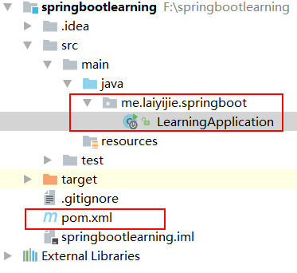
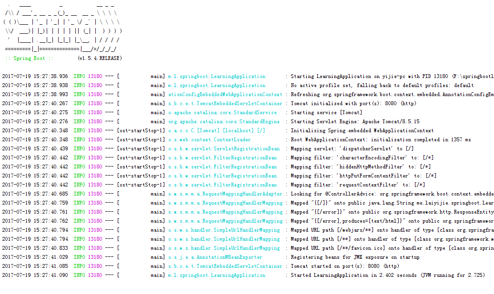
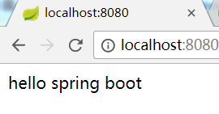

转载请注明来源 [赖赖的博客](http://laiyijie.me)

## 导语 

> 了解配置原理才能善用配置，才能对产品和技术更有信心

这篇文章将带你进入Spring Boot的世界，并简单介绍Spring Boot的AutoConfig的使用以及其pom的简单依赖关系和每种pom的作用

<!-- more -->

## 实例

### 项目工程目录结构和代码获取地址

#### 获取地址（TAG将会注明不同版本对应的课程）
[https://github.com/laiyijie/Spring-Boot-Learning](https://github.com/laiyijie/Spring-Boot-Learning)

#### 目录结构  

  

如图所示，是一个标准的Maven工程，只有两个核心的文件，pom.xml 和 LearningApplication.java
其余的为IDEA、git所要用到的文件或者Maven编译出来的文件（可以忽略）

##### 运行方式　　
- 右键 LearningApplication并运行（跟运行一个最普通的办好 Main函数的Java类一样）

##### 运行结果  

控制台：

  

打开浏览器输入： http://localhost:8080/

  

其实是一个简单的Web服务

### 项目详解  

下面我们来看一下这个项目到底是怎么样的

项目就一个代码文件以及一个pom文件

我们不妨从LearningApplication.java 入手看

#### LearningApplication.java

    package me.laiyijie.springboot;
    
    import org.springframework.boot.SpringApplication;
    import org.springframework.boot.autoconfigure.SpringBootApplication;
    import org.springframework.web.bind.annotation.RequestMapping;
    import org.springframework.web.bind.annotation.RestController;
    
    @SpringBootApplication
    @RestController
    public class LearningApplication{
    
        @RequestMapping("/")
        public String tee(){
            return "hello spring boot";
        }
    
        public static void main(String[] args) throws Exception {
            SpringApplication.run(LearningApplication.class, args);
        }
    
    }

忽略注解，由于我们是直接运行这个类的，我们不妨从这个类的Main函数入手！

##### Main函数

    public static void main(String[] args) throws Exception {
        SpringApplication.run(LearningApplication.class, args);
    }

Main函数只有一行代码！

    SpringApplication.run(LearningApplication.class, args);

就是调用了一个叫做SpringApplication.run的方法，并且把当前类传了进去！

在我们之前学过的Spring MVC的相关知识，我们知道，一个Web应用是需要依托一个Web容器的（例如tomcat），而且需要在web.xml中配置Spring的DispatcherServlet以及其WebApplicationContext，例如：

    <servlet>
        <servlet-name>appServlet</servlet-name>
        <servlet-class>org.springframework.web.servlet.DispatcherServlet</servlet-class>
        <init-param>
            <param-name>contextConfigLocation</param-name>
            <param-value>/WEB-INF/spring/appServlet/servlet-context.xml</param-value>
        </init-param>
        <load-on-startup>1</load-on-startup>
    </servlet>

这是一个Spring MVC的 web.xml的标准配置。

也就是说，SpringApplication.run 这个方法，帮我们完成了这些动作！

1. 启动了一个tomcat
2. 配置了项目相应的 web.xml并放入启动的tomcat的当中运行

通过日志我们也可以看到

	Tomcat initialized with port(s): 8080 (http)
	Starting service [Tomcat]
	Starting Servlet Engine: Apache Tomcat/8.5.15
	Initializing Spring embedded WebApplicationContext
	Root WebApplicationContext: initialization completed in 1357 ms

也就是上面我们说的那些事，确实是通过这一行代码完成了！

那是如何完成的呢？

这就要看LearningApplication前面的几个注解了

##### 类注解 @SpringBootApplication

这个注解其实是由三个注解组合而成的

1. @Configuration
2. @EnableAutoConfiguration
3. @ComponentScan

这样解释的话，就简单很多了！

@Configuration是Spring采用JavaConfig方式的一个注解，在当前示例中，并没有什么用