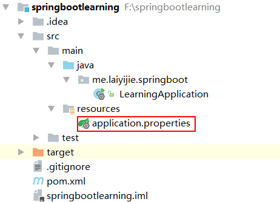
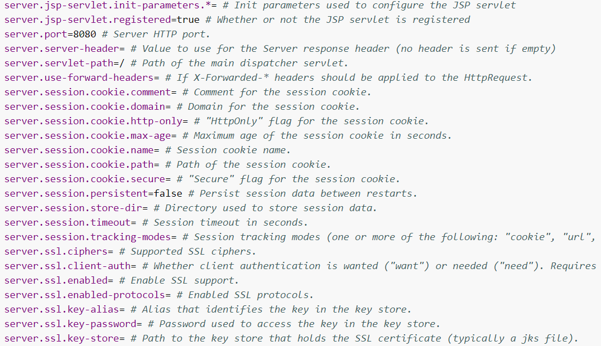
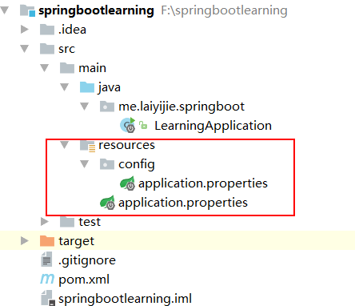

转载请注明来源 [赖赖的博客](http://laiyijie.me)

## 导语 

> 学会如何获取资源和知识，才是学习的基础。

在spring-boot-01中我们简单的了解到了如何启动一个spring-boot工程，现在出现一个问题，我电脑中的8080端口被占用了，我想修改Spring boot的默认端口，应该怎么办？

还有其他的一些默认配置是什么？我去哪儿找？又是如何修改？

这篇文章将带你解决这些问题

<!-- more -->

## 实例

### 项目工程目录结构和代码获取地址

#### 获取地址（TAG将会注明不同版本对应的课程）
[https://github.com/laiyijie/Spring-Boot-Learning](https://github.com/laiyijie/Spring-Boot-Learning)

#### 目录结构 

 

可以看出，与上一节课相比，只多了一个文件，就是 application.properties

##### 运行方式　　
- 右键 LearningApplication并运行（跟运行一个最普通的办好 Main函数的Java类一样）

##### 运行结果  

打开浏览器输入： http://localhost:8888/

可以看出服务器的端口被改成了**8888**而不是原来的**8080**端口

### 项目详解  

除了新增的application.properties文件以外，其他的和上一章节是一样的，因此我们着重看这个文件：

#### application.properties

	server.port=8888

只有一行！修改了server.port为8888

我们从这个文件可以看出，在spring-boot的机制里面，会查找classpath下面的application.properties文件进行属性读取。

那第一个问题来了，还有哪些属性可以修改？这些属性名字都是什么？

##### 通用属性列表

请参考[Spring 官方文档 common-application-properties](https://docs.spring.io/spring-boot/docs/current/reference/html/common-application-properties.html)

大概就是这个样子的：

你不妨再试一试这个属性：

	server.servlet-path=/

修改这个属性为
	server.servlet-path=/hi/

再次运行后结果如下：

我们必须在url后面加上/hi/才能正常访问，与其描述一致。

那么接下来我们就想了，配置是否能放到其他的地方呢？如果可以，那他们的优先级都是怎样的呢？

##### 属性设置优先级

我对工程做了一些修改，目录结构变成如下：

 

可以看到，我在 classpath/config 下又增加了一个文件，文件的名称也叫 application.properties，里面的内容为：

	server.port=9999

我们再次运行程序：

9999生效了！而不是classpath下的application.properties配置的8888生效。

那么，application.properties都可以放在什么位置呢？优先级又是怎样的呢？如下所示：

1. A /config subdirectory of the current directory.
2. The current directory
3. A classpath /config package
4. The classpath root

[官方文档链接](http://docs.spring.io/spring-boot/docs/1.5.4.RELEASE/reference/htmlsingle/#boot-features-external-config-application-property-files)

修改配置的方式只有这一种么？如果有多种是否有优先级？

关于配置的种类和详细信息请参考：[spring boot 官方文档 boot-features-external-config](http://docs.spring.io/spring-boot/docs/1.5.4.RELEASE/reference/htmlsingle/#boot-features-external-config)

你只要耐心看一下就会发现，其实很简单，这些问题都解决了！

这就是Spring Boot的默认配置修改方式。顺序大概是这样：

1. 我要调整一下属性
2. 在[官方通用属性表](https://docs.spring.io/spring-boot/docs/current/reference/html/common-application-properties.html)中查看一下有没有相关可以调整的属性？
3. 根据[spring boot 官方文档 boot-features-external-config](http://docs.spring.io/spring-boot/docs/1.5.4.RELEASE/reference/htmlsingle/#boot-features-external-config)选择合适的方式配置属性
4. 修改属性值

