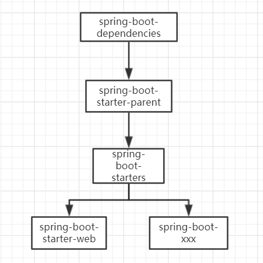

转载请注明来源 [赖赖的博客](http://laiyijie.me)

## 导语 

> 深入一点，迷惑就少一点。

本节接着spring-boot-02，主要目的是为了了解项目的依赖方面，具体的说也就是pom.xml（我使用 maven进行依赖管理）
如果你不熟悉maven建议可以先去熟悉一下，否则以下内容可能会比较难懂，当然也可以一边看一边查找相关内容，并不是很复杂。

<!-- more -->

## 实例

### 项目工程目录结构和代码获取地址

#### 获取地址（TAG将会注明不同版本对应的课程）
[https://github.com/laiyijie/Spring-Boot-Learning](https://github.com/laiyijie/Spring-Boot-Learning)

本节示例请参考 spring-boot-02 

### 项目详解 

pom.xml 

	<?xml version="1.0" encoding="UTF-8"?>
    <project xmlns="http://maven.apache.org/POM/4.0.0"
             xmlns:xsi="http://www.w3.org/2001/XMLSchema-instance"
             xsi:schemaLocation="http://maven.apache.org/POM/4.0.0 http://maven.apache.org/xsd/maven-4.0.0.xsd">
        <modelVersion>4.0.0</modelVersion>
    
        <groupId>me.laiyijie</groupId>
        <artifactId>spring-boot-learning</artifactId>
        <version>1.0-SNAPSHOT</version>
    
        <parent>
            <groupId>org.springframework.boot</groupId>
            <artifactId>spring-boot-starter-parent</artifactId>
            <version>1.5.4.RELEASE</version>
        </parent>
    
        <dependencies>
            <dependency>
                <groupId>org.springframework.boot</groupId>
                <artifactId>spring-boot-starter-web</artifactId>
            </dependency>
        </dependencies>
    
    </project>

核心点是两部分，一个是`<parent>`标签，一个是`<dependency>`标签

我们不妨从 spring-boot-starter-parent 入手，看看它到底是啥。

#### parent
    <parent>
        <groupId>org.springframework.boot</groupId>
        <artifactId>spring-boot-starter-parent</artifactId>
        <version>1.5.4.RELEASE</version>
    </parent>
    

##### spring-boot-starter-parent-1.5.4.RELEASE.pom

	<?xml version="1.0" encoding="UTF-8"?><project xmlns="http://maven.apache.org/POM/4.0.0" xmlns:xsi="http://www.w3.org/2001/XMLSchema-instance" xsi:schemaLocation="http://maven.apache.org/POM/4.0.0 http://maven.apache.org/xsd/maven-4.0.0.xsd">
		<modelVersion>4.0.0</modelVersion>
		<parent>
			<groupId>org.springframework.boot</groupId>
			<artifactId>spring-boot-dependencies</artifactId>
			<version>1.5.4.RELEASE</version>
			<relativePath>../../spring-boot-dependencies</relativePath>
		</parent>
		<artifactId>spring-boot-starter-parent</artifactId>
		<packaging>pom</packaging>
		......
		<dependencyManagement>
			<dependencies>
				<dependency>
					<groupId>org.springframework</groupId>
					<artifactId>spring-core</artifactId>
					<version>${spring.version}</version>
					<exclusions>
						......
					</exclusions>
				</dependency>
			</dependencies>
		</dependencyManagement>
		<build>
			<!-- Turn on filtering by default for application properties -->
			<resources>
				<resource>
					<directory>${basedir}/src/main/resources</directory>
					<filtering>true</filtering>
					<includes>
						<include>**/application*.yml</include>
						<include>**/application*.yaml</include>
						<include>**/application*.properties</include>
					</includes>
				</resource>
				<resource>
					<directory>${basedir}/src/main/resources</directory>
					<excludes>
						<exclude>**/application*.yml</exclude>
						<exclude>**/application*.yaml</exclude>
						<exclude>**/application*.properties</exclude>
					</excludes>
				</resource>
			</resources>
			<pluginManagement>
				......
			</pluginManagement>
		</build>
	</project>

我使用`......`来代替一些现在不关注的内容，我们可以看到 spring-boot-starter-parent-1.5.4.RELEASE.pom 做了这么四件事情：

1. 继承了`spring-boot-dependencies`（我们等下再来看这是个什么东西）
2. 增加了一个依赖管理（dependencyManagement），只管理了spring-core的版本
3. 配置资源的解析（resource），具体作用可以参考[这里](https://maven.apache.org/plugins/maven-resources-plugin/examples/filter.html)
4. 配置了maven插件管理（pluginManagement）这里暂不赘述

那么`spring-boot-dependencies`是个啥呢？

##### spring-boot-dependencies-1.5.4.RELEASE.pom

	<?xml version="1.0" encoding="UTF-8"?><project xmlns="http://maven.apache.org/POM/4.0.0" xmlns:xsi="http://www.w3.org/2001/XMLSchema-instance" xsi:schemaLocation="http://maven.apache.org/POM/4.0.0 http://maven.apache.org/xsd/maven-4.0.0.xsd">
		<modelVersion>4.0.0</modelVersion>
		<groupId>org.springframework.boot</groupId>
		<artifactId>spring-boot-dependencies</artifactId>
		<version>1.5.4.RELEASE</version>
		<packaging>pom</packaging>
		......
		<properties>
			<!-- Dependency versions -->
			<activemq.version>5.14.5</activemq.version>
			......
			<versions-maven-plugin.version>2.2</versions-maven-plugin.version>
		</properties>
		<dependencyManagement>
			<dependencies>
				<!-- Spring Boot -->
				<dependency>
					<groupId>org.springframework.boot</groupId>
					<artifactId>spring-boot</artifactId>
					<version>1.5.4.RELEASE</version>
				</dependency>
				......
			</dependencies>
		</dependencyManagement>
		<build>
			<pluginManagement>
				......
			</pluginManagement>
			<plugins>
				......
			</plugins>
		</build>
	</project>

做了如下几件事：

1. 增加依赖管理（dependencyManagement）
2. 增加maven插件管理（pluginManagement）
3. 增加maven插件（plugins）

这样的话，我们可以综合起来看，
spring-boot-starter-parent-1.5.4.RELEASE.pom 做了这么3件事情

1. 增加了一个依赖管理（dependencyManagement），管理了常用的版本
2. 配置资源的解析（resource），具体作用可以参考[这里](https://maven.apache.org/plugins/maven-resources-plugin/examples/filter.html)
3. 配置了maven插件管理（pluginManagement）以及增加了一些插件（这里暂不赘述）

也就是在`<parent>`这个标签中，我们**没有引入任何依赖**！**只引入了一些依赖管理**！

明白了`<parent>`所做的事情，也就很容易理解为什么spring官方文档会墙裂推荐这种引入方式，因为很简单的就完成了上述的三件事情，否则要通过比较复杂的方式实现这种功能（分别在 依赖管理，插件管理，插件引入这个pom）。

#### dependency

    <dependency>
        <groupId>org.springframework.boot</groupId>
        <artifactId>spring-boot-starter-web</artifactId>
    </dependency>

##### spring-boot-starter-web.pom

	<?xml version="1.0" encoding="UTF-8"?>
	<project xmlns="http://maven.apache.org/POM/4.0.0" xmlns:xsi="http://www.w3.org/2001/XMLSchema-instance" xsi:schemaLocation="http://maven.apache.org/POM/4.0.0 http://maven.apache.org/xsd/maven-4.0.0.xsd">
		<modelVersion>4.0.0</modelVersion>
		<parent>
			<groupId>org.springframework.boot</groupId>
			<artifactId>spring-boot-starters</artifactId>
			<version>1.5.4.RELEASE</version>
		</parent>
		<artifactId>spring-boot-starter-web</artifactId>
		......
		<dependencies>
			<dependency>
				<groupId>org.springframework.boot</groupId>
				<artifactId>spring-boot-starter</artifactId>
			</dependency>
			......
		</dependencies>
	</project>

你可以认为只做了一件事：

1. 增加了创建一个web程序所需要的依赖，而且这些依赖的版本早已经在`parent`继承的时候就被确认了，所以我们在引入这个依赖的时候并不需要写版本号！

但是目前看起来还是很复杂，因为我们对`spring-boot-starter-web`、`spring-boot-dependencies`和`spring-boot-starter-parent`之间的关系并不清晰！所以我画了一张图

### spring-boot常用pom之间的依赖关系图

以下讨论暂时忽略对maven插件的管理（plugin和pluginMangement）

1. spring-boot-dependencies 是依赖管理（dependencyManagement)
2. spring-boot-starter-parent 增加了必要的资源处理（对application*.properties和application*.yaml进行了转义）
3. spring-boot-starters 集合了所有的spring-boot-starter-xxx
4. spring-boot-starter-xxx 真正定义了所有的依赖

你还在害怕继承 spring-boot-starter-parent会造成什么不必要的影响吗？不妨看看源码吧！

