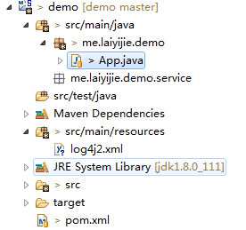

## 前景概要  

不管是做什么项目，日志都是不可或缺的  

- 跟踪代码执行过程
- 跟踪错误
- 记录重要操作

而log4j 是功能最强的一个日志工具，用于输出Log。  
为了保证Spring系列的完整性，今天简单介绍一下log4j2 的使用和简单配。

<!-- more -->
## 实例  

简单使用log4j2  

### 项目工程结构  

### 运行结果  
右键运行 App.java

> 09:30:26.495 [main] DEBUG me.laiyijie.demo.App - I ' m just try this!
> 09:30:26.495 [main] DEBUG me.laiyijie.demo.App - I ' m just try this!

### 项目详解  

#### App.java  

	package me.laiyijie.demo;
	
	import java.sql.SQLException;
	
	import org.apache.logging.log4j.LogManager;
	import org.apache.logging.log4j.Logger;
	
	public class App {
	
		public static final Logger logger = LogManager.getLogger(App.class);
	
		public static void main(String[] args) throws SQLException, ClassNotFoundException {
	
			logger.debug("I ' m just try this!");
	
		}
	
	}

输出日志过程如下：  
1. 通过`LogManager`的`getLogger`方法拿到`App.class`的这个类
2. 调用`logger.debug`输出日志  
用起来非常简单，但是为何一行代码输出了两次log？问题就出在日志的配置上了  

而其配置也非常简单：  

#### log4j2.xml  
	
	<?xml version="1.0" encoding="UTF-8"?>
	<Configuration>
	
		<Properties>
			<Property name="logFilePath">D:/logs/</Property>
		</Properties>
	
		<Appenders>
			<Console name="Console" target="SYSTEM_OUT">
				<PatternLayout pattern="%d{HH:mm:ss.SSS} [%t] %-5level %logger{36} - %msg%n" />
			</Console>
	
			<RollingFile name="fileAppender" fileName="${logFilePath}debug/log.txt"
				filePattern="${logFilePath}debug/log-%d{MM-dd-yyyy}.log.gz"
				ignoreExceptions="false">
				<PatternLayout>
					<Pattern>[%d{MMdd HH:mm:ss SSS}] - %m%n</Pattern>
					<Charset>UTF-8</Charset>
				</PatternLayout>
				<TimeBasedTriggeringPolicy />
			</RollingFile>
			
		</Appenders>
	
	
		<Loggers>
			<Logger name="me.laiyijie.demo" level="debug">
				<AppenderRef ref="Console" />
				<AppenderRef ref="fileAppender"></AppenderRef>
			</Logger>
			
			<Root level="debug">
				<AppenderRef ref="Console" />
				<AppenderRef ref="fileAppender"></AppenderRef>
			</Root>
		</Loggers>
	
	</Configuration>

这些配置，可以满足绝大部分的场景，也就是说，已经是比较完整的一个配置了，只要理解了这个配置，基本上除非有特殊需求，否则无需再进一步配置。  
在这个配置中主要涉及到了三个部分（也就是`Configuration`下面一级配置有三部分）  
1. Properties - 只是配置一下常用属性，便于更改，在同一个配置文件中通过`${xxx}`引用  
2. Appenders - 配置Log需要从哪儿输出，输出格式是什么  
3. Loggers - 控制不同包里面的日志使用不同的`Appenders`（输出器）以及输出的日志等级  

下面详细介绍`Loggers`和`Appenders`  

#### Appenders  

在这个配置文件中配置了两个`Appenders`:  
1. Console - 输出到控制台，具体格式为`<PatternLayout pattern="%d{HH:mm:ss.SSS} [%t] %-5level %logger{36} - %msg%n" />` ，这些输出的格式在此不详细介绍，完全可以用的时候再去查找[官方文档](http://logging.apache.org/log4j/2.x/manual/layouts.html#PatternLayout)  
2. RollingFile - 以天为单位分文件输出到指定位置，并指定打包名称，输出文件位置为`fileName="${logFilePath}debug/log.txt"`，打包文件名称为`filePattern="${logFilePath}debug/log-%d{MM-dd-yyyy}.log.gz"`，输出样式为`<Pattern>[%d{MMdd HH:mm:ss SSS}] - %m%n</Pattern>` 详细的配置可以参照[RollingFileAppender官方文档](http://logging.apache.org/log4j/2.x/manual/appenders.html#RollingFileAppender)  

说白了就是配置各种各样不同的输出器，以保证可以输出到不同的位置，而我们运行程序以后看到的样式结果就是通过`Console`这个Appender来进行输出的。  
那到底是为何输出了两条呢？让我来看看Loggers的配置就知道了

#### Loggers  

这个配置中有两条：  

- Logger - 以包名为基础控制不同包下的日志输出行为，下面介绍其属性  
	1. name - `name="me.laiyijie.demo"`,也就是意味着，在`me.laiyijie.demo`包下面的所有类中的Logger都被包含在这个Logger之内（注意：**包括其所有子包**，例如`me.laiyijie.demo.service`）
	2. level - `level="debug"` 在`debug`等级以上的日志都需要输出，日志等级按严重程度递减排序为（fatal，error，info，debug，trace）也就是说，除了trace以外的其他所有都会输出
	3. 关联输出器（Appenders）可以看出Console关联了两个输出器，分别是`Console`和`fileAppender`，也就是说既会输出在控制台，也会输出在文件

- ROOT - 根输出器，工程中所有的日志管理，在这里也是配置了两个Appender-ref，`Console`和`fileAppender`  

有Logger和ROOT分别输出了一条到`Console`这也是为什么一行语句会有两个输出到控制台的原因！！  

如果想解决这个问题，也就是说想要输出过一次日志后不再输出，就要通过`additivity="false"`来控制，也就是说把Logger的配置更换如下：  

	<Logger name="me.laiyijie.demo" level="debug" additivity="false">
		<AppenderRef ref="Console" />
		<AppenderRef ref="fileAppender"></AppenderRef>
	</Logger>

增加了一个`additivity`属性！这样的话，日志检测到后不会继续向下传递到ROOT再次输出。  

配置完毕，愉快快的使用log4j2吧！请记住，配置文件要放在classpath中，并且以log4j.xml为名称。详细载入配置文件过程可以参考[官方文档中的自动配置](http://logging.apache.org/log4j/2.x/manual/configuration.html#AutomaticConfiguration)  

### 附：  

#### pom.xml 

	<project xmlns="http://maven.apache.org/POM/4.0.0" xmlns:xsi="http://www.w3.org/2001/XMLSchema-instance"
		xsi:schemaLocation="http://maven.apache.org/POM/4.0.0 http://maven.apache.org/xsd/maven-4.0.0.xsd">
		<modelVersion>4.0.0</modelVersion>
	
		<groupId>me.laiyijie</groupId>
		<artifactId>demo</artifactId>
		<version>0.0.1-SNAPSHOT</version>
		<packaging>jar</packaging>
	
		<dependencies>
	
			<!-- https://mvnrepository.com/artifact/org.apache.logging.log4j/log4j-core -->
			<dependency>
				<groupId>org.apache.logging.log4j</groupId>
				<artifactId>log4j-core</artifactId>
				<version>2.7</version>
			</dependency>
	
		</dependencies>
	</project>
